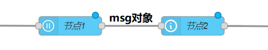
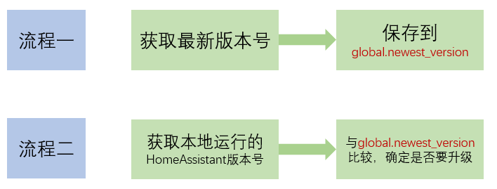

# 节点间信息传递

## 深入流程中传递的`msg`

复杂数据样例：

- `inject`节点输出：

    + `msg.url`

        `https://aa015h6buqvih86i1.api.met.no/weatherapi/locationforecast/2.0/complete?lat=31.336337255279158&lon=121.50233459367884`

    + `msg.headers`

        `{"User-Agent":"Node-RED"}`

- 获取某个时间点的温度值

    `msg.payload.properties.timeseries[8].data.instant.details.air_temperature`

## Context

在不同的节点间共享信息的一种机制

- Context作用域

    + 节点：仅写入信息的节点内部可见
    + 流程（flow）：在同一流程页面中的节点可见
    + 全局（global）：所有节点可见

- 样例：比较从网络获得的版本号与实际版本号

    

    需改进部分：
    + 判断获取的版本号的有效性

    大家可以自己尝试：
    + 使用Email提醒升级
    + 不使用context机制，使用`join`节点整合数据，进行比较