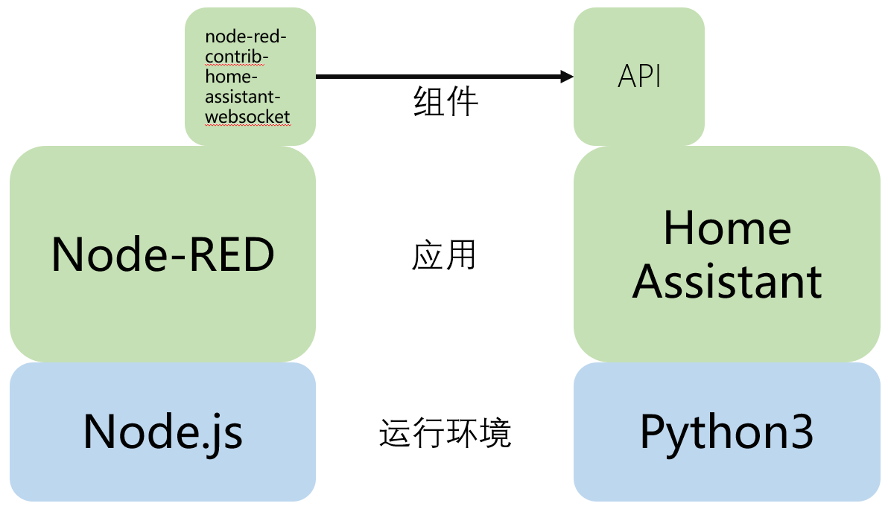

# PiOS下Node-RED的安装

## 操作步骤

1. Node-RED架构
2. 在树莓派上安装Node-RED
3. 启动Node-RED
4. 创建第一个流程

## 参考
- Node-RED与HomeAssistant 

    
 
-  Node-RED网站

    [https://nodered.org/](https://nodered.org/)

- 树莓派上安装Node-RED

    `sudo apt-get install build-essential`

    `bash <(curl -sL https://raw.githubusercontent.com/node-red/linux-installers/master/deb/update-nodejs-and-nodered)`
 
