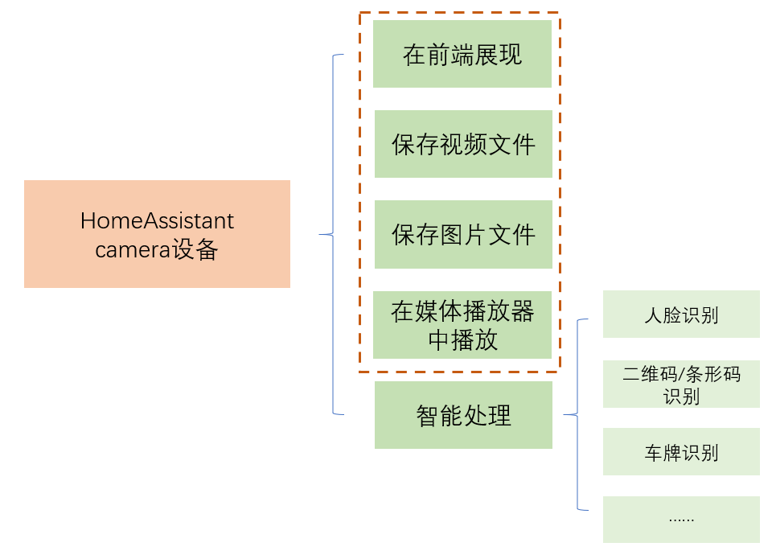

# camera设备操作



## 前端展现中的设置

将lovelace卡片中影像从10秒更新一次，变更为视频流：

- 卡片类型（type）：`picture-entity`
- 相机视图（camera_view）：`live`

## 保存图片与视频文件

- 对应目录加入`allowlist_external_dirs`

    ```yaml
    homeassistant:
      allowlist_external_dirs:
        - /share/camera_storage/
    ```

- 保存一帧图片

    ```yaml
    service: camera.snapshot
    target:
      entity_id: camera.yourcamera
    data:
      filename: '/share/camera_storage/camera_{{ now().strftime("%Y%m%d-%H%M%S") }}.jpg'
    ```

- 录视频文件

    ```yaml
    service: camera.record
    target:
      entity_id: camera.yourcamera
    data:
      duration: 10
      filename: '/share/camera_storage/camera_{{ now().strftime("%Y%m%d-%H%M%S") }}.mp4'
    ```


## 在媒体播放器中播放视频

```yaml
service: camera.play_stream
target:
  entity_id: camera.yourcamera
data:
  media_player: media_player.chromecast
```