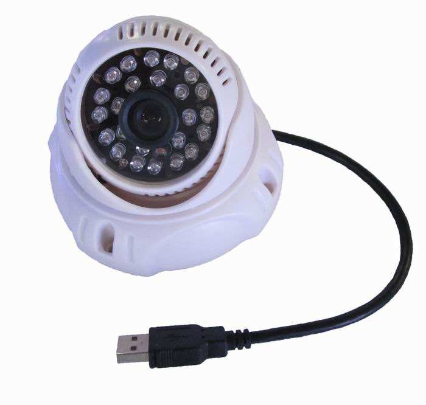
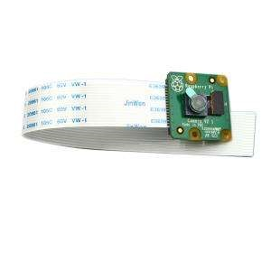

# 有线树莓派CSI与USB摄像头

**当前的HASSOS不支持CSI摄像头。如果要让HassOS支持CSI摄像头，可以参考[Getting the Raspberry Pi Camera to Work on HASSOS](https://gist.github.com/enegaard/a57af286205914bd912270c89650fb1b)。**

## 硬件准备

- 树莓派摄像头或USB口摄像头

     

## 操作步骤

1. 连接usb摄像头，查看设备
2. 在HA中使用ffmpeg配置USB口摄像头
3. CSI摄像头接入树莓派
4. 在HA中配置CSI口摄像头
5. `raspistill`工具

## 参考

- 本地USB摄像头配置

    ```yaml
    camera:
      - platform: ffmpeg
        name: cam4
        input: /dev/video0
    ```

- 本地CSI摄像头配置

    ```yaml
    rpi_camera:
        name: cam5
    ```
- 本地CSI摄像头配置说明

    [https://www.home-assistant.io/integrations/rpi_camera](https://www.home-assistant.io/integrations/rpi_camera)

- raspistill工具说明

    [https://www.raspberrypi.org/documentation/usage/camera/raspicam/raspistill.md](https://www.raspberrypi.org/documentation/usage/camera/raspicam/raspistill.md)
