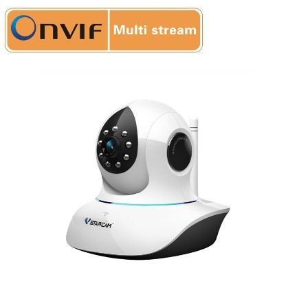

# ONVIF协议摄像头

## 硬件准备

- 支持ONVIF协议的摄像头

  

- 或者Android手机

## 操作步骤

1. 查看摄像头配置页面
2. ONVIF协议摄像头接入
3. 手工调用`camera.onvif_ptz`服务
4. 编写脚本，调用`camera.onvif_ptz`服务

## 参考

- ONVIF摄像头配置说明

  [https://www.home-assistant.io/integrations/onvif](https://www.home-assistant.io/integrations/onvif)

- onvif协议摄像头配置

  ```yaml
  camera:
    - platform: onvif
      host: 192.168.3.163
      port: 8080
      name: cam3
      profile: 1
  ```

- `camera.onvif_ptz`服务调用脚本

  ```yaml
  cam3_turnright:
    alias: cam3右转
    sequence:
      - service: camera.onvif_ptz
        data:
          entity_id: camera.cam3
          pan: RIGHT
  cam3_turnleft:
    alias: cam3左转
    sequence:
      - service: camera.onvif_ptz
        data:
          entity_id: camera.cam3
          pan: LEFT
  ```
