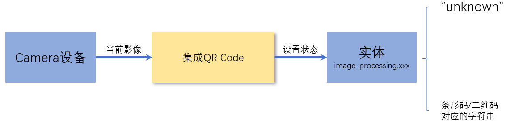
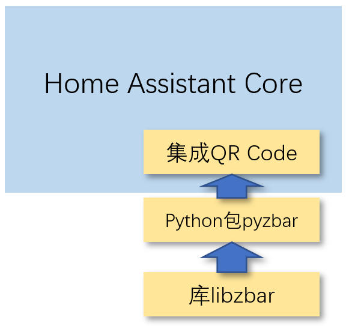

# 二维码识别



## [集成QR Code](https://www.home-assistant.io/integrations/qrcode/)的运行依赖库



- [Python包pyzbar](https://pypi.org/project/pyzbar/)
    + 当集成QR Code启动时，会自动安装pyzbar
    + 在HomeAssistant的官方docker镜像中，已经提前安装好了pyzbar
- [libzbar](http://zbar.sourceforge.net/)
    + 在HomeAssistant的官方docker镜像中，未安装libzbar
    + libzbar需要手工安装
        * `brew install zbar`（Mac OS X）
        * `apk add libzbar`（Alpine Linux）
        * `apt-get install libzbar0`（Linux）

        *每次HomeAssistant core的docker升级后，需要重新安装libzbar*


## 配置集成QR Code

```yaml
image_processing:
  - platform: qrcode
    source:
      - entity_id: camera.c8
    scan_interval: 1
```

- `scan_interval`：每隔多长时间进行一次图片识别，缺省为10秒
- 图片抓取与处理需要时间，需要根据实际情况设定scan_interval，避免来不及处理的情况
    + 本地摄像头抓取图片速度快
    + 网络视频流`mjpeg`格式的抓取图片速度快
    + 网络视频流不需要认证的抓取图片速度快
    + 二维码/条形码识别占用计算资源少

## 自动化

当识别到（特定的）二维码或条形码时，启动对应的处理程序。