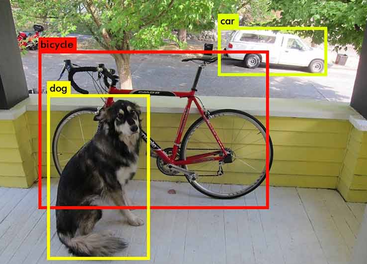
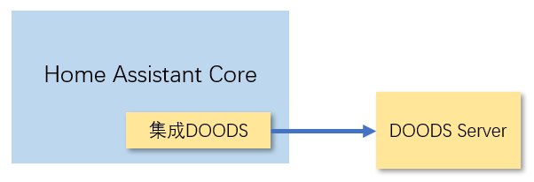

# DOODS物体识别

[DOODS](https://github.com/snowzach/doods/)：Dedicated Open Object Detection Service



## DOODS集成

[https://www.home-assistant.io/integrations/doods/](https://www.home-assistant.io/integrations/doods/)



**DOODS Server可以以HomeAssistant Add-on的形式运行，也可以以单纯的Docker容器形式运行**

集成DOODS vs. 集成TensorFlow

- 都是基于TensorFlow完成功能
- 都是基于已经训练好的神经网络模型进行识别
- 集成DOODS的物体识别服务可以分离部署
- 集成TensorFlow在集成内部完成物体识别功能
- 集成DOODS架构更灵活
- 集成DOODS安装与配置更简单

## DOODS Add-on

添加仓库：https://github.com/snowzach/hassio-addons

安装与运行集成：DOODS

*DOODS可以不依赖于Supervisor，直接在docker环境中运行，参见https://hub.docker.com/r/snowzach/doods*

## 集成配置

```yaml
image_processing:
  - platform: doods
    source:
      - entity_id: camera.c8
    scan_interval: 3
    url: "http://127.0.0.1:8080"
    detector: default
    confidence: 50
    file_out:
      - "/share/{{ camera_entity.split('.')[1] }}_{{ now().strftime('%Y%m%d_%H%M%S') }}.jpg"
    labels:
      - name: person
        confidence: 60
      - car
      - truck
      - dog
      - cat
```

*`default`和`tensorflow`识别模型都[支持的labels](https://raw.githubusercontent.com/amikelive/coco-labels/master/coco-labels-2014_2017.txt)*

智能判断的参数：

- confidence
- area
    + top(default: 0)
    + left(default: 0)
    + bottom(default: 1)
    + right(default: 1)
    + covers(default: true)

## DOODS服务的自定义配置

- 硬件加速
- 其它的神经网络模型
- 并行计算
