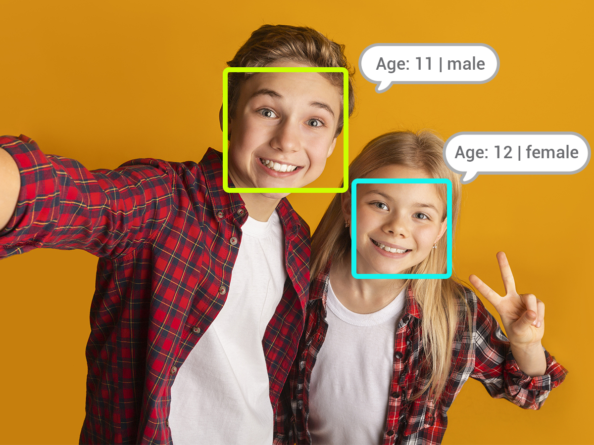
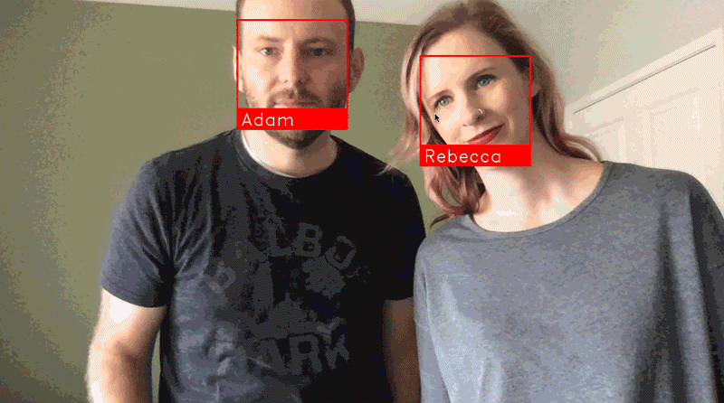
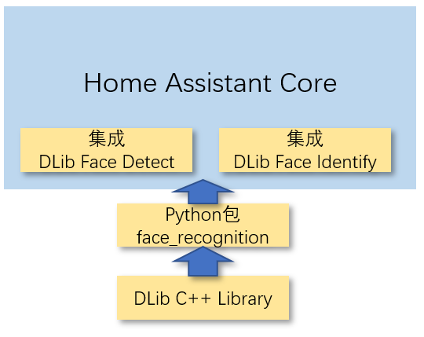

# DLib人脸探测与人脸识别

## 一些基本概念

- 人脸探测(Face Detect)

    

- 人脸识别(Face Identify)

    

- 依赖关系

    

    + [DLib人脸探测集成](https://www.home-assistant.io/integrations/dlib_face_detect/)和[DLib人脸识别](https://www.home-assistant.io/integrations/dlib_face_identify/)依赖于python库[face_recognition](https://pypi.org/project/face-recognition/)

    + python库[face_recognition](https://pypi.org/project/face-recognition/)使用了[DLib C++ Library](http://dlib.net/)

    + [DLib C++ Library](http://dlib.net/)中包含了各种机器学习算法和工具

    *在HomeAssistant Core的官方docker镜像中，没有事先安装face_recognition库*

## 在docker中安装依赖库

- 进入HomeAssistant Core的docker容器：

    `docker exec -it homeassistant bash`

- 查看DLib集成的依赖库

    `cat /usr/src/homeassistant/homeassistant/components/dlib_face_detect/manifest.json`

- 手工安装依赖库

    ```sh
    sed -i 's/dl-cdn.alpinelinux.org/mirrors.aliyun.com/g' /etc/apk/repositories
    apk add cmake build-base
    pip3 install face_recognition==1.2.3 -i https://mirrors.aliyun.com/pypi/simple/
    ```

    *国外用户可以不运行第一条命令，并且去除第三条命令中的`-i https://mirrors.aliyun.com/pypi/simple/`部分——这些是用于给国内用户加速的*

## 配置

- `configuration.yaml`

    ```yaml
    # configuration.yaml
    image_processing:
      - platform: dlib_face_detect
        scan_interval: 2
        source:
          - entity_id: camera.c8
            name: face_detect

      - platform: dlib_face_identify
        scan_interval: 999999
        source:
          - entity_id: camera.c8
            name: face_id
        faces:
          Andrew: /share/face/andrew.jpg

    homeassistant:
      allowlist_external_dirs:
        - /share/face/record/
    ```
- `scripts.yaml`

    ```yaml
    # scripts.yaml
    face_identify_script:
      alias: 人脸识别并保存图片
      sequence:
        - service: image_processing.scan
          data:
            entity_id: image_processing.face_id
        - service: camera.snapshot
          data:
            entity_id: camera.c8
            filename: /share/face/record/face_{{ now().strftime('%Y%m%d_%H%M%S') }}.jpg
    ```

## 自动化

- 当探测到人脸后，就启动`face_identify_script`

    ```yaml
    alias: Face Identify
    description: ''
    trigger:
      - platform: state
        entity_id: image_processing.face_detect
    condition:
      - condition: state
        entity_id: image_processing.face_detect
        state: '1'
    action:
      - service: script.face_identify_script
    mode: single
    ```

    *"State trigger fires when the state of any of given entities changes. If only entity_id is given, the trigger will fire for all state changes, even if only state attributes change. If only one of from_state or to_state are given, the trigger will fire on any matching state change, but not if only attributes change."*


- 当确认身份后，可以进行你希望的动作，比如开门

    ```yaml
    alias: "Andrew Coming..."
    trigger:
      platform: event
      event_type: image_processing.detect_face
      event_data:
        entity_id: image_processing.face_id
        name: "Andrew"
    ...
    ```
