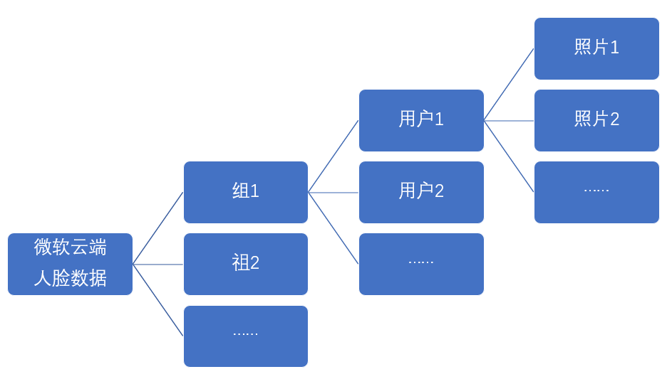

# 微软人脸识别与认证

## 操作步骤

1. 准备标准照待用
2. 在微软人脸云服务中配置组、用户、标准照片
3. 微软人脸识别配置解说
4. 使用vlc配置一个抓屏摄像头（同上一个视频）
5. 效果实验

## 参考

- 微软人脸云服务API说明

  https://westcentralus.dev.cognitive.microsoft.com/docs/services/563879b61984550e40cbbe8d/operations/563879b61984550f30395236

- 微软人脸云端数据结构

  

- 相关API调用命令
  + 创建组

    `curl -X PUT "https://westcentralus.api.cognitive.microsoft.com/face/v1.0/persongroups/presidents" \`

    `-H "Content-Type: application/json" \`

    `-H "Ocp-Apim-Subscription-Key: 4211c17af9b14ff581a41492bd7b069b" \`

    `--data-ascii "{'name': 'PresidentsInUS', 'userData': 'Presidents of United States'}"`

  + 创建用户

    `curl -X POST "https://westcentralus.api.cognitive.microsoft.com/face/v1.0/persongroups/presidents/persons" \`

    `-H "Content-Type: application/json" \`

    `-H "Ocp-Apim-Subscription-Key: 4211c17af9b14ff581a41492bd7b069b" \`

    `--data-ascii "{'name': 'Clinton', 'userData': 'Bill Clinton'}"`

  + 上传用户照片

    `curl -X POST \`

    `"https://westcentralus.api.cognitive.microsoft.com/face/v1.0/persongroups/presidents/persons/bb6d222a-8956-40ee-8a78-e00ccd3c6503/persistedFaces" \`

    `-H "Ocp-Apim-Subscription-Key: 4211c17af9b14ff581a41492bd7b069b" \`

    `-H "Content-Type: application/octet-stream" \`

    `--data-binary "@/home/pi/Pictures/clinton.jpg"`

  + 训练组

    `curl -X POST "https://westcentralus.api.cognitive.microsoft.com/face/v1.0/persongroups/presidents/train" \`

    `-H "Ocp-Apim-Subscription-Key: 4211c17af9b14ff581a41492bd7b069b" \`

    `--data-ascii ""`

- HA中微软人脸识别配置说明文档

  [https://www.home-assistant.io/integrations/microsoft_face_identify](https://www.home-assistant.io/integrations/microsoft_face_identify)

- 微软人脸识别与认证配置样例（`example_9_5_1.yaml`）

```yaml
# example_9_5_1.yaml
microsoft_face:
  api_key: 4211c17af9b14ff581a41492bd7b069b
  azure_region: westcentralus

image_processing:
  - platform: microsoft_face_identify
    scan_interval: 1000000
    group: presidents
    confidence: 10
    source:
      - entity_id: camera.cam_input
        name: ms_face_identify

script:
  ms_face_identify_script:
    alias: 微软人脸识别
    sequence:
      - service: image_processing.scan
        data:
          entity_id: image_processing.ms_face_identify

automation:
  - alias: Clinton Identify
    trigger:
      platform: event
      event_type: image_processing.detect_face
      event_data:
        entity_id: image_processing.ms_face_identify
        name: 'Clinton'
    action:
      service: persistent_notification.create
      data_template:
        title: '人脸认证'
        message: '克林顿出现在摄像头中，可信度{{ trigger.event.data.confidence }}%'
```

- VLC http mjpeg输出配置（同上一篇）

  `:sout=#transcode{vcodec=MJPG,vb=800,scale=自动,acodec=none,scodec=none}:standard{access=http{mime=multipart/x-mixed-replace; boundary=7b3cc56e5f51db803f790dad720ed50a},mux=mpjpeg,dst=:8888/} :no-sout-all :sout-keep`
