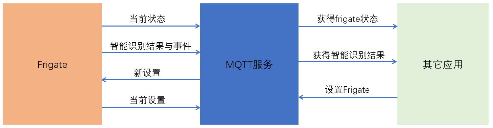

# Frigate(2)

## Frigate视频记录与对外服务

- 目录`/media/frigate/`

  `recordings/`子目录中保存历史视频记录

  `clips/`子目录中保存当识别到物体时的快照与短视频

  *如果是以标准docker模式运行的，`/media/frigate/`目录在构建容器时进行映射*

- rtmp视频流

  `rtmp://<Frigate_IP>:1935/live/<camera_name>`

- Web服务

  `http://<Frigate_IP>:5000/`

- [HTTP API](https://blakeblackshear.github.io/frigate/usage/api)

## MQTT消息与自动化

- MQTT消息

  
  
  消息主题与内容：https://blakeblackshear.github.io/frigate/usage/mqtt

- HomeAssistant中的自动化

  *前提： HomeAssistant与Frigate连接到同一个mqtt服务*

  ```yaml
  automation:
    - alias: Notify of events
      trigger:
        platform: mqtt
        topic: frigate/events
      action:
        - service: notify.mobile_app_pixel_3
          data_template:
            message: 'A {{trigger.payload_json["after"]["label"]}} was detected.'
            data:
              image: 'https://your.public.hass.address.com/api/frigate/notifications/{{trigger.payload_json["after"]["id"]}}/thumbnail.jpg?format=android'
              tag: '{{trigger.payload_json["after"]["id"]}}'
              when: '{{trigger.payload_json["after"]["start_time"]|int}}'
  ```

## 接入HomeAssistant

*你也可以在HACS中直接搜索Frigate，安装Frigate集成以及Lovelace卡片，但HACS在中国大陆使用不正常*

- [自定义集成`Frigate`](https://github.com/blakeblackshear/frigate-hass-integration)

  *增加Frigate集成，需要先配置集成mqtt，连接到MQTT服务器。*

  + 将`custom_components/frigate/`拷贝到`/config/custom_components/`
  + 重启HomeAssistant
  + 在前端添加集成`Frigate`

- [自定义Lovelace卡片](https://github.com/dermotduffy/frigate-hass-card)

  + 下载`frigate-hass-card.js`，[下载地址](https://github.com/dermotduffy/frigate-hass-card/releases)
  + 将`frigate-hass-card.js`放在`/config/www/`中
  + 添加资源`/local/frigate-hass-card.js`，类型为`module`
  + 在前端添加卡片
  


