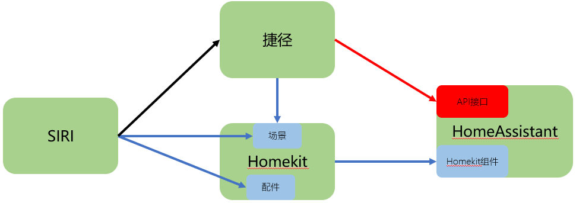

# 捷径与HA的接口调用

## 操作步骤

1. 申请访问HA的token
2. 使用curl访问HA的实体状态API演示
3. 在“捷径”中调用HA的API查询温度
4. 使用curl调用HA的服务API演示
5. 在“捷径”中调用HA的API控制灯

## 参考

- 调用结构

    

- HA的API参考

    [https://developers.home-assistant.io/docs/api/rest](https://developers.home-assistant.io/docs/api/rest)

- curl查询实体状态

    ```sh
    curl -X GET \
    -H "Authorization: Bearer xxxxxxxxxxx" \
    -H "Content-Type: application/json" \
    http://192.168.31.53:8123/api/states/xxx.xxxx
    ```

- curl命令调用开关服务

    ```
    curl -X POST \
    -H "Authorization: Bearer xxxxxxxxxxxxx" \
    -H "Content-Type: application/json" \
    -d '{"entity_id":"light.gateway_light_7c49eb18e3a7"}' \
    http://192.168.31.53:8123/api/services/light/toggle
    ```