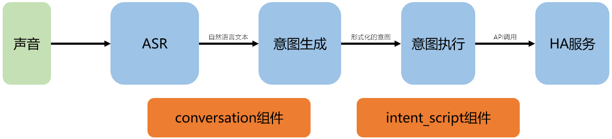

# 在HA中完成语音文字处理——chrome语音控制

## 操作步骤

1. 语音控制过程逻辑
2. conversation与intent_script组件配置
3. 在chrome浏览器中实现语音控制

## 参考
- 语音控制逻辑结构

  

- HA中conversation组件配置说明

  [https://www.home-assistant.io/integrations/conversation](https://www.home-assistant.io/integrations/conversation)

- HA中intent_script组件配置说明

  [https://www.home-assistant.io/integrations/intent_script](https://www.home-assistant.io/integrations/intent_script)

- 配置样例

  ```yaml
  # example_11_4_1.yaml
  conversation:
    intents:
      GetTemperature:
        - "[现在][当前]室内温度[是]多少"
      OpenLight:
        - "打开{item}[的]灯"
        - "把{item}[的]灯打开"
      CloseLight:
        - "关上{item}[的]灯"
        - "关闭{item}[的]灯"

  intent_script:
    GetTemperature:
      speech:
        text: 当前室内温度{{ states.sensor.temperature_158d0001d6daa6.state }}摄氏度

    OpenLight:
      async_action: true
      speech:
        text: 正在打开{{ item }}灯
      action:
        service: homeassistant.turn_on
        data_template: 
          entity_id: >
            
              light.reading_room
            
              light.none
            

    CloseLight:
      async_action: true
      speech:
        text: 正在关闭{{ item }}灯
      action:
        service: homeassistant.turn_off
        data_template: 
          entity_id: >
            
              light.reading_room
            
              light.none
             
  ```