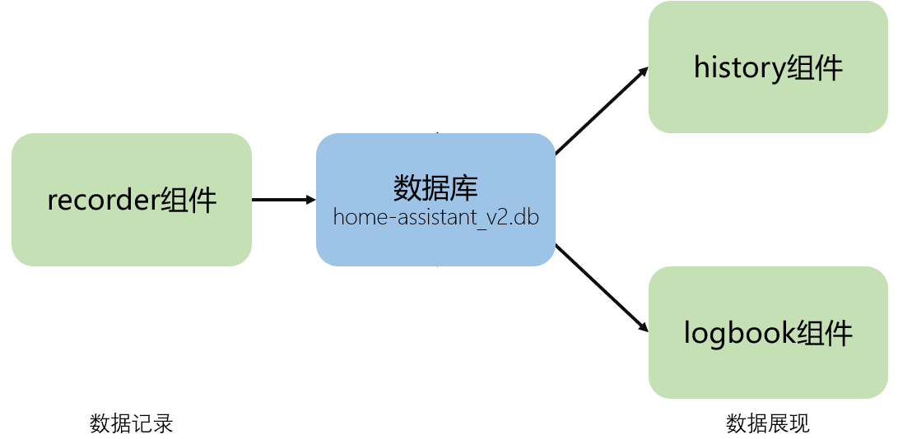

# 历史数据基础概念

## 操作步骤

1. 数据相关组件
2. 安装`DB Browser for SQLite`
3. 查看记录的数据
4. 手工清理数据
5. 清空数据

## 参考
- 数据相关组件

    

- `DB Browser for SQLite`网站

    [http://sqlitebrowser.org/](http://sqlitebrowser.org/ )
