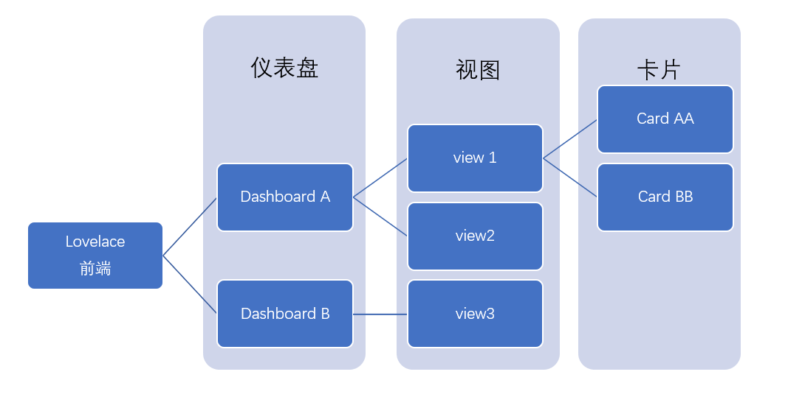
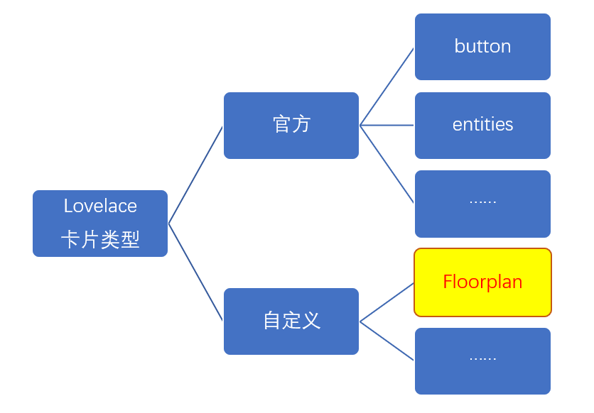
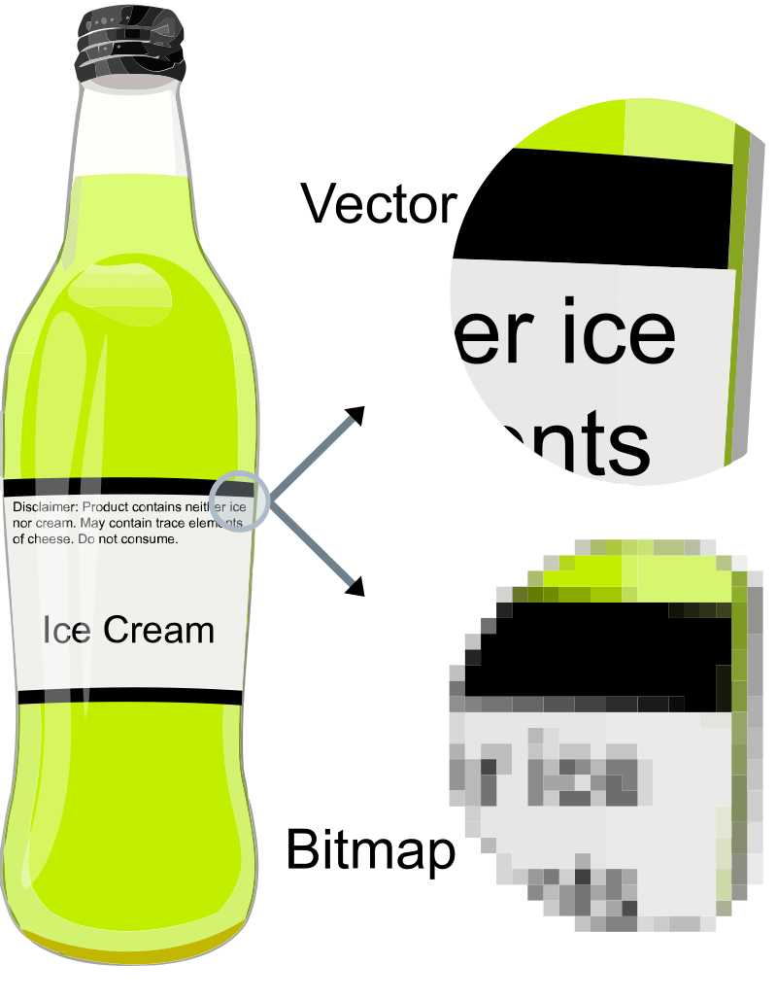

# Floorplan技术基础与安装

## Floorplan是什么

- 自定义HomeAssistant的前端展现
- 不陷入复杂的前端开发技术

*另一个可选择的技术是基于[AppDaemon](https://appdaemon.readthedocs.io/en/latest/index.html)的[HADashboard](https://appdaemon.readthedocs.io/en/latest/DASHBOARD_INSTALL.html)，我们会在后续的篇章中介绍*

#### Floorplan是Lovelace前端中的自定义卡片

- Lovelace结构

- Lovelace卡片类型

## SVG矢量图

- 点阵图vs.矢量图

    + 点阵图（位图）定义图像中每个像素的颜色值
    + 矢量图是用点、直线或者多边形等基于数学方程的几何对象表示的图像

- SVG(Scalable Vector Graphics)是一种矢量图格式规范，支持交互与动画
- [Inkscape](https://inkscape.org/)是编辑SVG格式矢量图的免费开源工具软件

**SVG定义了图像中的几何对象(elements)；Floorplan通过改变几何对象(elements)的属性，在前端进行不同的呈现。**

## 安装Floorplan自定义卡片

- `floorplan.js`

  下载地址：https://github.com/ExperienceLovelace/ha-floorplan/raw/master/dist/floorplan.js

  保存在`/config/www/floorplan/`目录中

- 在Lovelace配置中添加对应资源

  `配置`-`仪表盘`-`资源`-`添加资源`