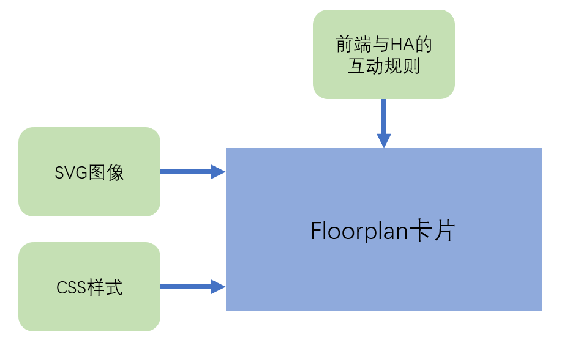

# Floorplan实践



- 在前端界面中展现SVG图像
- CSS定义展现的样式
- 互动规则：
  + 对象：HomeAssistant中的实体、SVG中的element
  + 触发：HomeAssistant中实体状态变化、前端用户界面操作
  + 动作：调用HomeAssistant中的服务、修改SVG图像的展现（Element的属性、显示样式等）


## 资源文件

将[资源文件]()放置在`/config/www/floorplan/example/`目录中

- `home.svg`

  在文件中定义了以下元素（element）：

  + `camera1`
  + `outsides_temp`
  + `lightA`
  + `boardA`

- `home.css`

  样式文件，可以无内容，但不可为空（`0`字节）

- `light_on.svg`

  点亮的灯

- `light_off.svg`

  熄灭的灯


## 添加卡片

```yaml
type: 'custom:floorplan-card'
config:
  image: /local/floorplan/example/home.svg
  stylesheet: /local/floorplan/example/home.css
  log_level: debug
  rules:
    - entity: camera.c6hshe_xiang_tou
      element: camera1
      tap_action: more-info
    - entity: weather.wo_de_jia
      element: outsides_temp
      hover_action: hover-info
      state_action:
        action: call-service
        service: floorplan.text_set
        service_data: '${entity.attributes.temperature}'
    - entity: light.yeelight_color_0x2bdd4ed
      element: lightA
      state_action:
        - action: call-service
          service: floorplan.image_set
          service_data: '/local/floorplan/example/light_${entity.state}.svg'
        - action: call-service
          service: floorplan.style_set
          service_data:
            element: boardA
            style: 'opacity: ${ entity.state === "on" ? "0" : "0.6" };'
      tap_action:
        action: call-service
        service: homeassistant.toggle
```

## 美化

- `视图配置`-`视图类型`-`面板(单张卡片)`

- `full_height: true`

- 去除`log_level`

## 进一步学习

- 使用Inkscape制作矢量图：https://inkscape.org/learn/tutorials/
- Floorplan卡片的详细用法：https://experiencelovelace.github.io/ha-floorplan/docs/usage/
- CSS：https://www.w3schools.com/css/default.asp
