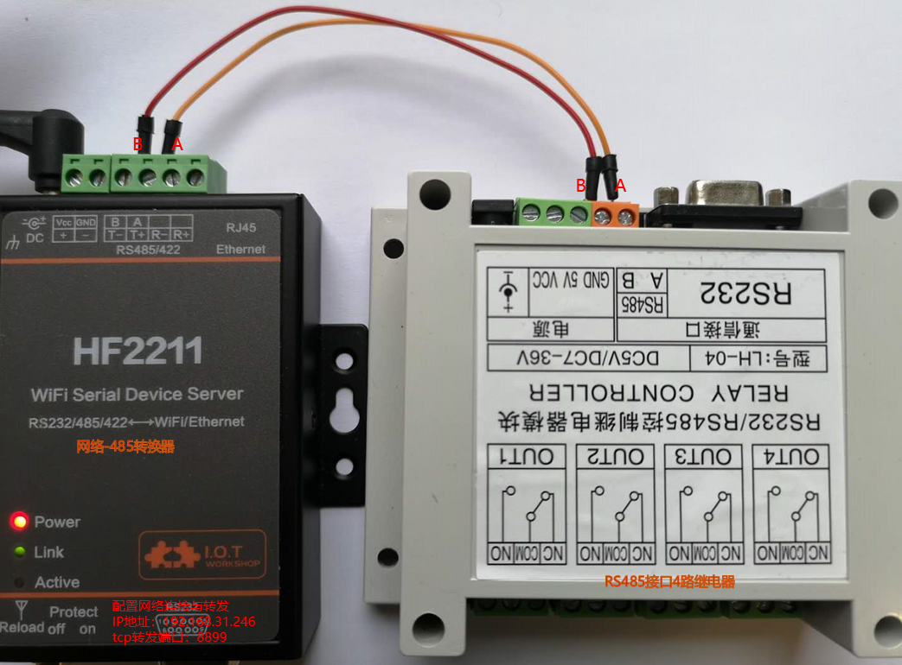

# 接入自定义ascii码指令集的设备

## 操作步骤

1. 阅读与理解协议
2. 硬件连接
3. 测试需要的指令
4. 配置switch.command_line
5. 增加command_state配置项

## 参考
- 接线图

    

- 测试命令

    `echo -e "AT+OUT2+1=ON\r\n" -n | nc -N 192.168.31.246 8899`

    `echo -e "AT+STATUS+1=?" -n | nc -N 192.168.31.246 8899 -i 1`

- switch.command_line配置说明

    [https://www.home-assistant.io/integrations/switch.command_line](https://www.home-assistant.io/integrations/switch.command_line)

- 配置

    ```yaml
    switch:
      - platform: command_line
        scan_interval: 3
        switches:
          my_relay1:
            command_on: "echo 'AT+OUT1+1=ON\r\n'|nc -i 1 -N 192.168.31.246 8899"
            command_off: "echo 'AT+OUT1+1=OFF\r\n'|nc -i 1 -N 192.168.31.246 8899"
            command_state: "echo 'AT+STATUS+1=?\r\n'|nc -i 1 -N 192.168.31.246 8899"
            value_template: "{{ 'OUT1 OF No.1 IS ON' in value }}"
    ```
