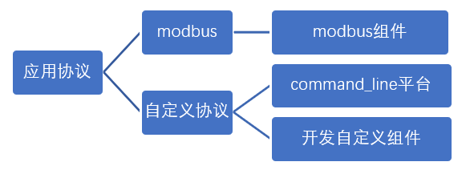

# 自定义二进制命令设备的接入

## 操作步骤

1. 自定义组件程序解释

    [custom_components/bus485_example/switch.py](custom_components/bus485_example/switch.py)

2. 配置自定义组件并演示

    ```yaml
    switch:
      - platform: bus485_example
    ```

3. 485小结

    

## 参考
- 自定义组件相关文件

    [https://www.home-assistant.io/integrations#search/command%20line](https://www.home-assistant.io/integrations#search/command%20line)

- 样例程序

    `custom_components/bus485_example`目录下三文件：

    - [custom_components/bus485_example/switch.py](custom_components/bus485_example/switch.py)
    - [custom_components/bus485_example/manifest.json](custom_components/bus485_example/manifest.json)
    - [custom_components/bus485_example/__init__.py](custom_components/bus485_example/__init__.py)
