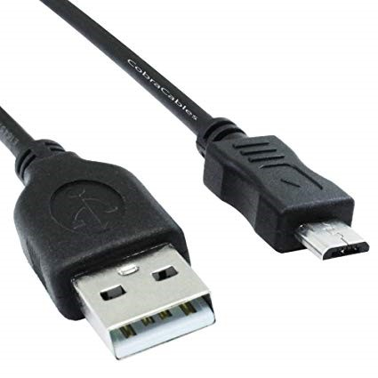

# ESP8266——固件烧录与连接

## 硬件准备

- NodeMCU/WEMOS D1 mini/...（多选一）

    

- USB数据线

    
 
## 操作步骤

1. 安装esptool工具
2. 下载MicroPython固件
3. 在NodeMCU/D1 mini上烧录MicroPython
4. 使用Putty进行连接
5. 在NodeMCU/D1 mini上点亮板载LED
6. 在PiliBoard上进行操作

## 参考

- MicroPython固件下载地址

    [http://micropython.org/download/esp8266/](http://micropython.org/download/esp8266/)

- NodeMCU通讯驱动（cp2102）

    [https://www.silabs.com/search#q=cp2102&t=Documentation&sort=relevancy&f:@common_allowed_content_type=[Software]](https://www.silabs.com/search#q=cp2102&t=Documentation&sort=relevancy&f:@common_allowed_content_type=[Software])

- D1 mini通讯驱动（ch340g）

    [http://www.wch.cn/download/CH341SER_ZIP.html](http://www.wch.cn/download/CH341SER_ZIP.html)

- 烧入固件命令

    + 安装esptool工具（linux上加上sudo执行）：

        `pip install esptool`

    + 清空固件（如果安装后无法直接使用esptool命令，请使用esptool.py；linux下的串口在/dev目录下，一般形式为/dev/ttyUSBn，例如/dev/ttyUSB0）：

        `esptool --port COMx erase_flash`

    + 写入固件：

        `esptool --port COMx --baud 115200 write_flash 0 esp8266-20210202-v1.14.bin`

        *注：部分型号的NodeMCU，需增加命令参数 `-fm dio`*

- 点亮LED灯

    ```python
    import machine
    p2 = machine.Pin(2,machine.Pin.OUT)
    p2.value(1) # 熄灭
    p2.value(0) # 点亮
    ```

-  MicroPython官网

    [http://www.micropython.org/](http://www.micropython.org/)
