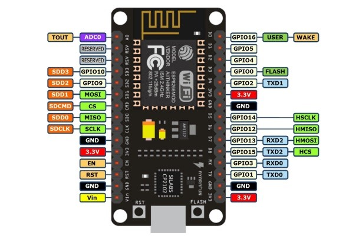
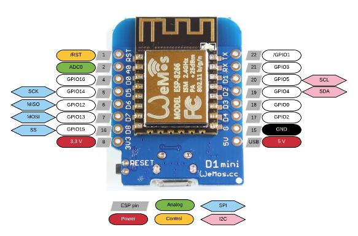
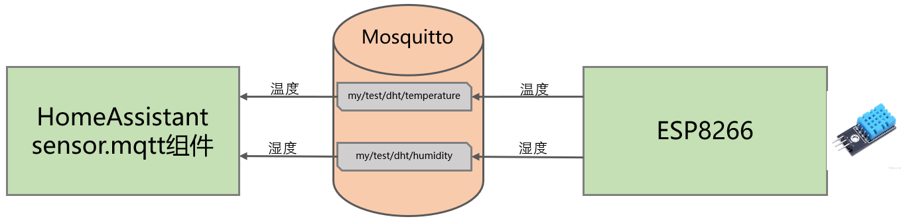

# 连接ESP8266的DHT温湿度传感器
## 硬件准备

温湿度传感器：dht11/dht22


## 操作步骤

1. 硬件连接
2. 读取温湿度
3. 向MQTT服务器发送温度值
4. HomeAssistant中的配置
5. 8266中的自启动运行

## 参考

- 开发板管脚

    

- mqtt连接逻辑

    

- 程序

    ```python
    import dht
    import machine
    import time
    from ubinascii import hexlify
    from umqtt.simple import MQTTClient

    # 初始化一个温湿度传感器, 温湿度传感器连接4号GPIO
    DHT = dht.DHT11(machine.Pin(4))

    # CLIENT_ID: 每个mqtt客户端有自己独立的client_id标识
    # 无所谓是什么，但不同客户端不能相同。此处我们使用8266的unique_id
    client_id = hexlify(machine.unique_id()).decode()
    mqtt_broker = "192.168.31.193"
    mqtt_user = 'pi'
    mqtt_password = 'hachina'

    # 温度和湿度在mqtt服务器上的主题位置
    TEMPERATURE_TOPIC = "my/test/dht/temperature"
    HUMIDITY_TOPIC = "my/test/dht/humidity"

    # 等待15秒，wifi自动连接上再运行
    time.sleep(15)

    mqtt = MQTTClient( client_id, mqtt_broker, 1883, mqtt_user, mqtt_password )
    mqtt.connect()
    print("连接到服务器：{s}".format(s=mqtt_broker))

    while True:
        # 不断循环，每10秒测量一次温度和湿度，发布到mqtt服务器上
        try:
            DHT.measure()
        except:
            print("No dht sensor connected to Pin(%d)"%(PIN_NO))
            break
        print("测量到温度：%d；湿度：%d"%(DHT.temperature(),DHT.humidity()))

        # mqtt发布信息
        mqtt.publish( TEMPERATURE_TOPIC, str(DHT.temperature()).encode(), retain=True)
        mqtt.publish( HUMIDITY_TOPIC, str(DHT.humidity()).encode(), retain=True)
        time.sleep(10)
    ```

- HomeAssistant中配置

    ```yaml
    sensor mqtt:
      - platform: mqtt
        name: "dht-T"
        state_topic: "my/test/dht/temperature"
        unit_of_measurement: "°C"
      - platform: mqtt
        name: "dht-H"
        state_topic: "my/test/dht/humidity"
        unit_of_measurement: "%"
    ```
 
