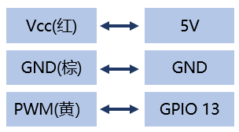
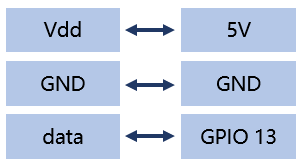
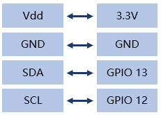
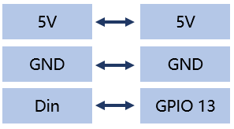

# ESP8266完成各种功能

## 操作步骤

1. 从INTERNET同步时间
2. WEB服务器
3. PWM舵机控制
4. ds18b20温度传感器
5. tsl2561光照传感器
6. ws2812灯带控制

## 参考

- ESP8266功能与常用应用领域

| 功能 | 常用应用领域 |
| :-- | :-- |
| 网络 | NTP客户端、MQTT客户端、WEB服务器端/客户端 |
| 常规GPIO输入输出 | 状态量读取与输出、继电器控制 |
| GPIO PWM | 可调亮度LED、可控硅控制、舵机控制 |
| 1-wire总线通讯 | 连接ds18b20等各种1-wire总线器件 |
| I2C总线通讯 | 连接am2320等各种i2c总线器件 |
| SPI总线通讯 | 连接各种SPI总线器件 |
| ADC模拟信号输入 | 测量输入电压、模拟传感器连接 |
| apa102、neopixel驱动 | 各种灯带控制 |
| 中断 | 按钮输入 |
| 计时器 | 定时控制 |
| …… | …… |

- MicroPython参考文档网站

    [http://docs.micropython.org/en/latest/](http://docs.micropython.org/en/latest/)

- 各种用例与程序

    [https://github.com/zhujisheng/piliboard/tree/master/examples](https://github.com/zhujisheng/piliboard/tree/master/examples)

- NTP访问

    ```python
    import ntptime
    import time
    ntptime.settime()
    t = time.localtime()
    print("当前国际标准时间：%d年%d月%d日 %d:%d:%d"%(t[0],t[1],t[2],t[3],t[4],t[5]))
    ```

- 一个最简单的WEB服务器

    ```python
    response = """<!DOCTYPE html>
    <html>
        <head> <title>ESP 8266</title>
        <meta http-equiv="Content-Type" content="text/html; charset=utf-8" />
        </head>
        <body><h1>欢迎来到MicroPython的世界</h1></body>
    </html>
    """

    import socket
    addr = socket.getaddrinfo('0.0.0.0', 80)[0][-1]

    s = socket.socket()
    s.bind(addr)
    s.listen(1)
    print('listening on', addr)

    while True:
        cl, addr = s.accept()
        print('client connected from', addr)
        cl_file = cl.makefile('rwb', 0)
        while True:
            line = cl_file.readline()
            if not line or line == b'\r\n':
                break
        cl.send(response)
        cl.close()
    ```

- PWM舵机控制

    

    ```python
    import machine
    pin_no = 13
    servo = machine.PWM(machine.Pin(pin_no), freq=50)
    servo.duty(30)
    ```

- DS18b20温度传感器

    

    ```python
    import time
    import machine
    import onewire, ds18x20
    dat = machine.Pin(13)

    ds = ds18x20.DS18X20(onewire.OneWire(dat))

    roms = ds.scan()
    print('找到设备：', roms)

    # 循环10次，每次打印所有设备测量的温度
    while True:
        print('温度：', end=' ')
        ds.convert_temp()
        time.sleep_ms(750)
        for rom in roms:
            print(ds.read_temp(rom), end=' ')
        print()
    ```

- tsl2561光照传感器

    [https://github.com/adafruit/micropython-adafruit-tsl2561/blob/master/docs/tsl2561.rst](https://github.com/adafruit/micropython-adafruit-tsl2561/blob/master/docs/tsl2561.rst)

    

    ```python
    import tsl2561
    import time
    from machine import I2C, Pin
    i2c = I2C(scl=Pin(12), sda=Pin(13))
    sensor = tsl2561.TSL2561(i2c)
    while True:
        print(sensor.read())
        time.sleep_ms(750)
    ```

- ws2812灯带控制

    

    ```python
    from machine import Pin
    from neopixel import NeoPixel

    leds_num = 30
    dp = Pin(13, Pin.OUT)
    np = NeoPixel(dp, leds_num)
    for i in range(leds_num):
        np[i] = (0, 0, 0)
        np.write()

    # 按红、绿、蓝、白显示灯带
    color = [(255,0,0),(0,255,0),(0,0,255),(255,255,255)]    #红、绿、蓝、白
    for i in range(0,np.n):
        np[i] = color[i%4]
    np.write()
    ```
