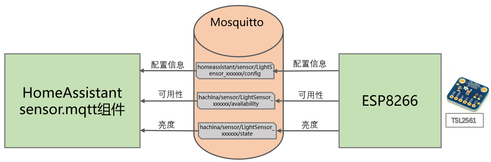
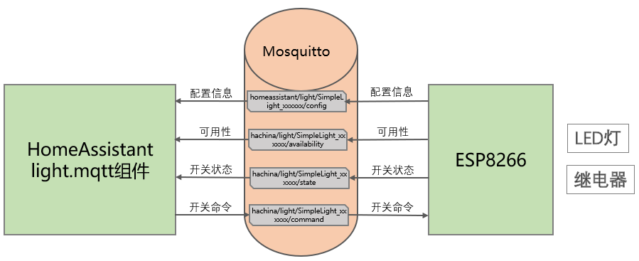
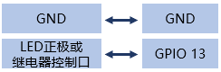

# 典型样例讲解：光照传感器与智能灯

# 操作步骤

1. 光照传感器

    

2. 智能灯

    

## 参考

- 光照传感器：[样例example_17_5_1.zip](example_17_5_1.zip) 

    

    | 文件 | 说明 | 备注 |
    | :-- | :-- | :-- |
    |config.json | wifi和mqtt的配置信息 | 你需要修改为你自己的环境 |
    | main.py | 启动时自动运行的文件 | 也可以不上传这个文件，手工运行其中命令 |
    | tsl2561.py | tsl2561驱动程序 | 如果使用其它传感器，不需要此文件 |
    | sensor_tsl2561.py | 主程序 | 可以修改GPIO口为你实际的连接口；连接其它传感器，修改对应硬件操作部分程序 |

- 智能灯：[样例example_17_5_2.zip](example_17_5_2.zip)

    

    | 文件 | 说明 | 备注 |
    | :-- | :-- | :-- |
    |config.json | 同上 |
    | main.py | 同上 |
    | StateMQTTClient | 基于umqtt.simple的一个自己实现的mqtt类 | 其中增加了对ping返回的判断，并增加了是否连接的状态 |
    | light_gpio.py | 主程序 | 可以修改GPIO口为你实际的连接口 |
