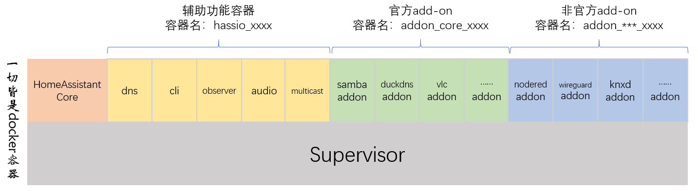
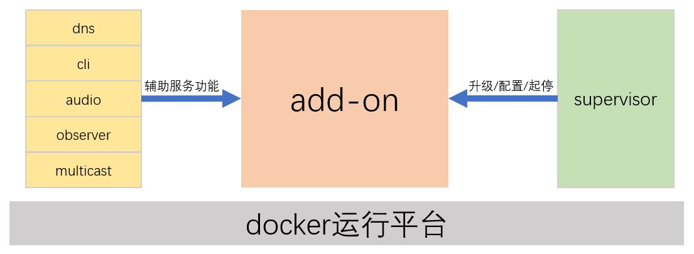

# Add-on基础概念

## add-on是什么

**add-on本质上是docker容器**

*add-on是与HomeAssistant Core并行运行的*

## 如何进入add-on内部

`docker exec -it addon_xxxx bash`

## 管理add-on

*对add-on的管理和服务功能，具体该如何进行，保存在每个add-on的配置文件中*

## add-on仓库

- 官方addon仓库
 
    [https://github.com/home-assistant/addons](https://github.com/home-assistant/addons)

- HA社区addon仓库

    [https://github.com/hassio-addons/repository](https://github.com/hassio-addons/repository)

- 本地addon仓库

    共享的`/addons/`目录

## 一些重要的学习资源

- add-on开发官方网站
 
    [https://developers.home-assistant.io/docs/add-ons](https://developers.home-assistant.io/docs/add-ons)

- Dockerfile语法参考

    [https://docs.docker.com/engine/reference/builder/](https://docs.docker.com/engine/reference/builder/)

