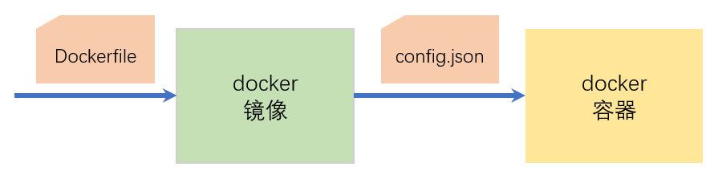
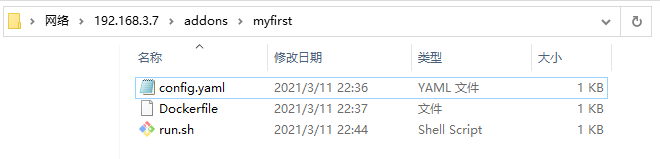

# 构建第一个add-on

## 两个核心配置文件



- `Dockerfile`：如何构建docker镜像
- `config.(json/yaml/yml)`：如何运行docker镜像

## `Dockerfile`

*`Dockerfile`是docker框架本身使用的一个文件*

```
ARG BUILD_FROM
FROM $BUILD_FROM

# Copy data for add-on
COPY run.sh /
RUN chmod a+x /run.sh

CMD [ "/run.sh" ]
```

- `run.sh`

    ```sh
    #!/bin/sh

    echo Hello world!
    ```

## `config.(json/yaml/yml)`

Supervisor读取`config`文件，决定如何从镜像生成docker容器，以及对应add-on的一些属性

- `config.json`

    ```json
    {
      "name": "Hello world",
      "version": "1.0.0",
      "slug": "hello_world",
      "description": "My first real add-on!",
      "arch": ["armhf", "armv7", "aarch64", "amd64", "i386"]
    }
    ```

- `config.yaml`

    ```yaml
    name: Hello world
    version: 1.0.0
    slug: hello_world
    description: My first real add-on!
    arch:
      - armhf
      - armv7
      - aarch64
      - amd64
      - i386
    ```

## 本地的add-on仓库

- 位置：共享的`/addons/`目录
- 可以在这个目录下构建子目录，每个子目录代表一个add-on
- 将add-on相关的文件放置在子目录中

    

- 仓库内容`reload `

- 改写`run.sh`永远运行不退出

    ```sh
    #!/bin/sh
    while true
    do
        echo Hello world!
        sleep 5
    done
    ```


