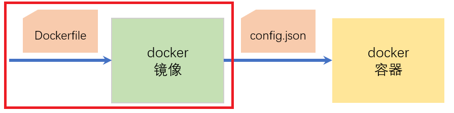
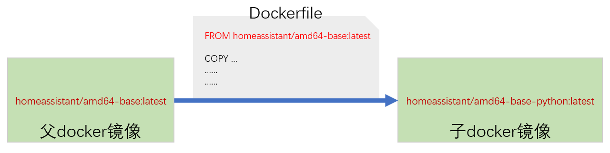

# docker镜像的生成



## 父镜像与build配置文件

- `Dockerfile`中的`FROM`语句

    

- HomeAssistant基础镜像

    https://github.com/home-assistant/docker-base#home-assistant-base-images

- `build.(json/yaml/yml)`文件

    ```json
    {
      "build_from": {
        "armhf": "homeassistant/armhf-base-python:latest",
        "armv7": "homeassistant/armv7-base-python:latest",
        "aarch64": "homeassistant/aarch64-base-python:latest",
        "amd64": "homeassistant/amd64-base-python:latest",
        "i386": "homeassistant/i386-base-python:latest"
      }
    }
    ```

    + build文件可以使用json格式，也可以使用yaml格式
    + 如果只是从`homeassistant/xxxxx-base:latest`构建镜像的，可以不需要build配置文件
    + `Dockerfile`中以下语句保持不变

        ```
        ARG BUILD_FROM
        FROM $BUILD_FROM
        ```


## 样例：运行WEB服务

本样例使用python3中提供的`http.server`，开启一个WEB服务器。

- `build.json`

    ```json
    {
      "build_from": {
        "armhf": "homeassistant/armhf-base-python:latest",
        "armv7": "homeassistant/armv7-base-python:latest",
        "aarch64": "homeassistant/aarch64-base-python:latest",
        "amd64": "homeassistant/amd64-base-python:latest",
        "i386": "homeassistant/i386-base-python:latest"
      }
    }
    ```

- `Dockerfile`

    ```
    ARG BUILD_FROM
    FROM $BUILD_FROM

    CMD python3 -m http.server --directory / 8000
    ```

- `config.json`

    ```json
    {
      "name": "A Simple Web Server",
      "version": "1.0.0",
      "slug": "a_simple_web_server",
      "description": "This is a web server using python's http.server",
      "arch": ["armhf", "armv7", "aarch64", "amd64", "i386"]
    }
    ```

## 替代方案：apk安装

- 删除`build.json`

- `Dockerfile`

    ```
    ARG BUILD_FROM
    FROM $BUILD_FROM

    #RUN sed -i 's/dl-cdn.alpinelinux.org/mirrors.aliyun.com/g' /etc/apk/repositories
    RUN apk add --no-cache python3

    CMD python3 -m http.server --directory / 8000
    ```

- 如何事先测试Dockerfile中RUN命令的正确性？

    **可以构建一个上个视频中演示的简单add-on，然后使用`docker exec`命令登录到其中，测试各种命令的准确与有效性。**

## 基础镜像中的三个工具

- [`S6-Overlay`](https://github.com/just-containers/s6-overlay)

    docker容器初始化命令工具

    - 服务前脚本:`/etc/cont-init.d/*`
    - 服务脚本：`/etc/services.d/*/run`
    - 关闭脚本：`/etc/services.d/*/finish`
    - 参考样例：[https://github.com/home-assistant/addons/tree/master/samba](https://github.com/home-assistant/addons/tree/master/samba)

- [`Bashio`](https://github.com/hassio-addons/bashio)

    bash shell的功能库，提供add-on中常用功能的实现

- [`TempIO`](https://github.com/home-assistant/tempio)

    模板，一般用于将Add-on用户配置转化为服务配置文件

    参考样例：[ssh add-on的启动脚本](https://github.com/home-assistant/addons/blob/a1911ba819373766d6d2daf07c8a81b0521b631f/ssh/rootfs/etc/cont-init.d/ssh.sh)
