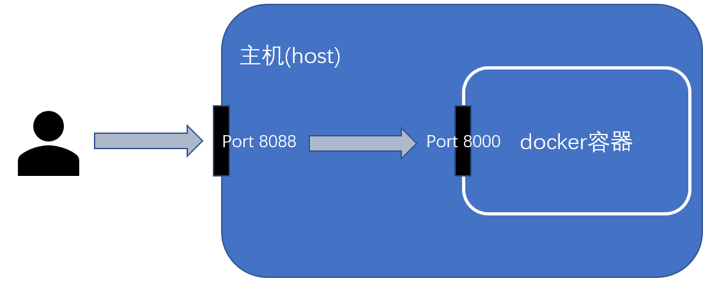
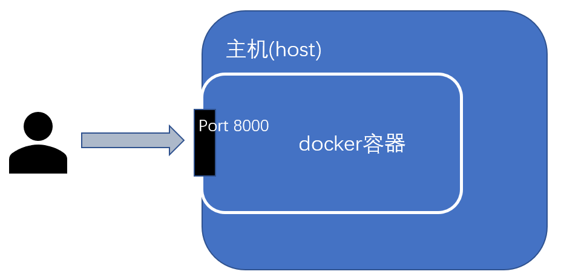

# add-on常用配置(1)

## 主要配置文件

| 文件名 | 功能 |
| :-- | :-- |
| `build.(json/yaml/yml)` | 定义docker镜像的父镜像 |
| `Dockerfile` | 定义如何生成docker镜像 |
| `README.md` | Add-on介绍，markdown格式 |
| `DOCS.md` | Add-on的使用与配置指南，markdown格式 |
| `logo.png` | LOGO图片 |
| `icon.png` | ICON图片，长宽比1:1 |
| `CHANGELOG.md` | 修改日志，markdown格式 |
| `config.(json/yaml/yml)` | 定义Add-on该如何运行 |

`config.(json/yaml/yml)`的完整配置手册：[https://developers.home-assistant.io/docs/add-ons/configuration#add-on-config](https://developers.home-assistant.io/docs/add-ons/configuration#add-on-config)

## Add-on的网络配置

- 端口映射

  

  ```yaml
  ports:
    8000/tcp: 8088
  ports_description:
    8000/tcp: web服务端口
  ```

- 主机网络

  

  ```yaml
  host_network: true
  ```

- OPEN WEB UI

  ```yaml
  ingress: true
  ingress_port: 8000
  ```

  *OPEN WEB UI并不依赖于端口映射或者主机网络配置*

