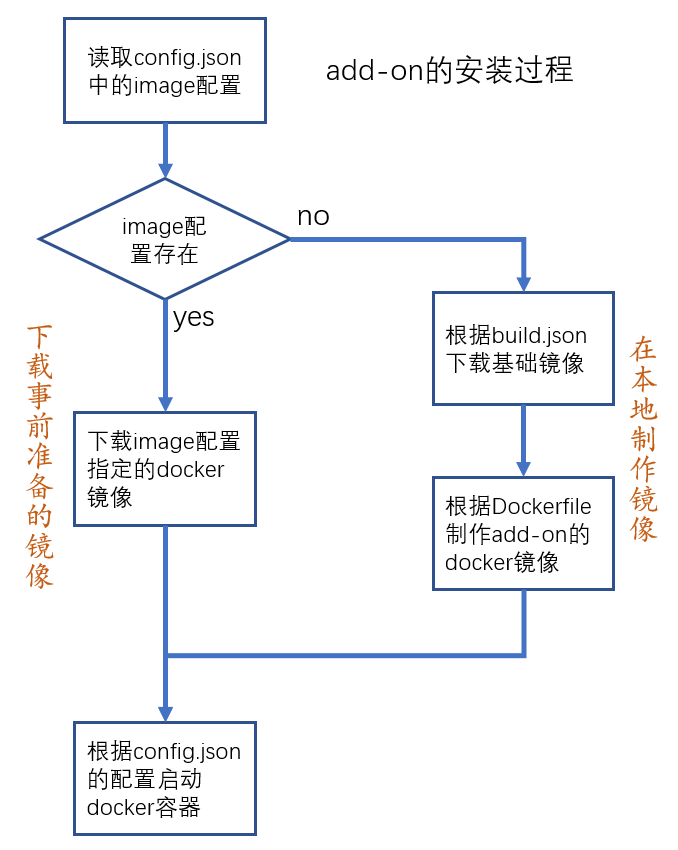

# 分享你的add-on

## 构建github上的add-on仓库

- github Repository
    + `repository.(json/yaml/yml)`
        + `name`
        + `url`
        + `maintainer`

样例：[https://github.com/zhujisheng/hassio-addons](https://github.com/zhujisheng/hassio-addons)

## 提前制作docker镜像

- add-on的安装过程

    

- 提前制作docker镜像的优点

    用户无需在本地执行`Dockerfile`中的安装、编译命令

    + 省用户的安装时间
    + 避免过程中的各种失败
    + 避免安装非作者预期的软件版本

- `image`配置

    样例：`image: zhujisheng/{arch}-addon-simple_proxy`

- 准备工作
    + 注册一个[https://hub.docker.com/](https://hub.docker.com/)的账号
    + 工作电脑安装docker环境(`curl -fsSL get.docker.com | sudo sh`)
    + 我一般选择在云服务器上完成工作

- 制作github上addon的docker镜像并上传

    + 运行命令

        ```
        docker run \
            --rm \
            --privileged \
            -v ~/.docker:/root/.docker \
            homeassistant/amd64-builder \
                --all \
                -t addon-folder \
                -r https://github.com/xy/addons \
                -b master \
                --docker-user username \
                --docker-password password
        ```

        需要修改内容：

        - `homeassistant/amd64-builder`：根据工作电脑的CPU架构，修改为`homeassistant/armv7-builder`或`homeassistant/aarch64-builder`
        - `addon-folder`：需要制作镜像的add-on所在的目录名
        - `https://github.com/xy/addons`：修改为你的github仓库URL
        - `master`：修改为你的github仓库的分支名称
        - `username`：修改为你在`hub.docker.com`上的用户名
        - `password`：修改为你在`hub.docker.com`上的密码


- 制作本地addon的docker镜像并上传

    ```
    docker run \
        --rm \
        --privileged \
        -v ~/.docker:/root/.docker \
        -v /my_addon:/data \
        homeassistant/amd64-builder \
            --all \
            -t /data \
            --docker-user username \
            --docker-password password
    ```

    - add-on放置在目录`/my_addon/`中

