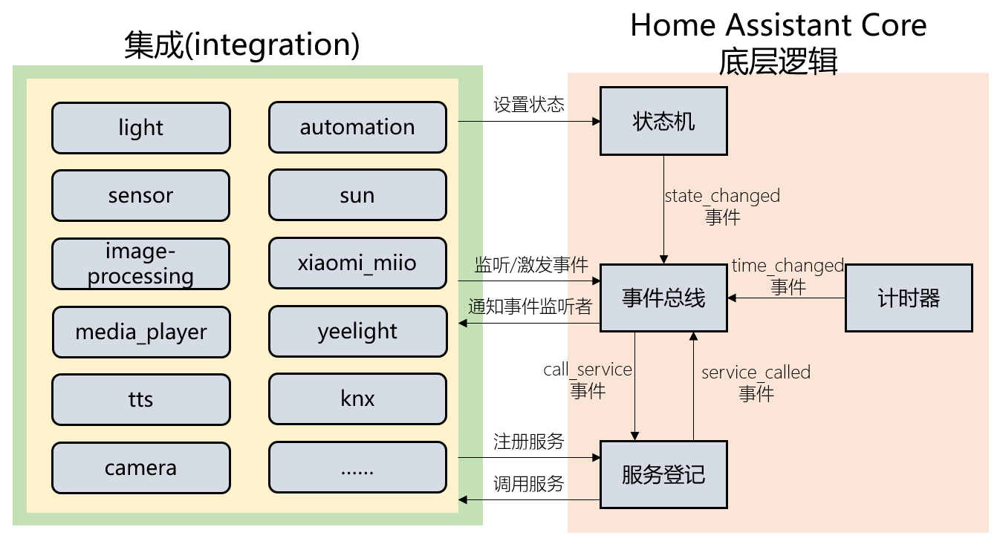

# 集成(integration)的基础概念

## 什么是集成？

- HomeAssistant整体架构

    *参见[《架构理解与基础操作》](../01.入门准备篇/5.架构理解与基础操作.md)*

    

- HomeAssistant Core的架构

    

    + 事件总线: 处理事件的监听与激发逻辑。

        参见：[《实体的值与展现》](../02.组件接入基础篇/7.实体的值与展现.md)

    + 状态机: 跟踪实体的状态。

        参见[《自动化机制中的事件》](../05.自动化篇/2.自动化机制中的事件.md)

    + 服务登记: 实现服务注册与服务调用的逻辑。

        参见[《自动化机制中的服务》](../05.自动化篇/3.自动化机制中的服务.md)

    + 计时器: 每秒发送一条`time_changed`事件

- 集成在哪里

    + [有哪些集成](https://www.home-assistant.io/integrations/#all)
    + [集成的源代码](https://github.com/home-assistant/core/tree/dev/homeassistant/components)

## 集成的类别

- 定义某一类事物的通用逻辑
    + `binary_sensor`
    + `sensor`
    + `light`
    + `camera`
    + `media_player`
    + `image_processing`
    + ……

- 与具体外部设备或服务交互
    + `hue`
    + `zwave`
    + `xiaomi_miio`
    + `knx`
    + ……

- 自动化逻辑
    + `automation`
    + `device_sun_light_trigger`
    + `flux`
    + ……

- 其它
    + `input_boolean`
    + `template`
    + `integration`
    + `sun`
    + ……

## 你需要知道的一些信息

- 官方参考：[https://developers.home-assistant.io/docs/development_index](https://developers.home-assistant.io/docs/development_index)
- HomeAssistant Core（包括集成）使用的是python语言

    [python学习资料](https://www.liaoxuefeng.com/wiki/1016959663602400)
