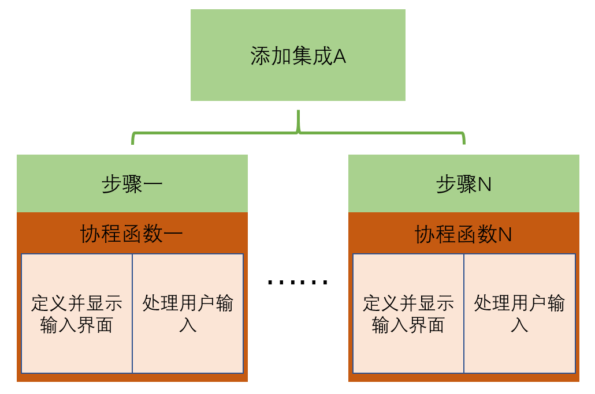

# 在前端添加集成

## 集成的源代码组成

样例：[hachina_example1](custom_components/hachina_example1/)

- `manifest.json`

    该集成的基本信息

    + `version`：对于自定义集成，要求有version值
    + `config_flow`：是否支持前端配置
    + `requirements`：依赖于其它集成
    + `dependencies`：依赖于python软件包

- `const.py`

    一些程序中要用到的常量

- `__init__.py`

    集成初始化时会加载的模块

- `config_flow.py`

    前端配置过程

- `translations/`

    各种语言下使用到的字符串

## 添加集成的程序结构

*前端添加集成的步骤、输入内容要求、以及对输入的处理，都是在`config_flow.py`中完成的*

- 添加集成的过程，分成若干步骤
- 每一个步骤，对应一个协程函数（coroutine function）
- 函数中的代码，主要实现两部分逻辑
    + 当用户还未输入时：定义配置页面内容，并显示页面
    + 用户已经输入时：处理用户输入（保存配置内容/进入下个配置步骤/设置报错信息）

## 编程与具体函数

- 协程函数(coroutine function)与回调函数(callback function)

    [https://developers.home-assistant.io/docs/asyncio_categorizing_functions](https://developers.home-assistant.io/docs/asyncio_categorizing_functions)

- [`voluptuous`库](https://github.com/alecthomas/voluptuous)

    定义信息的格式要求，对信息进行格式要求的验证

- `homeassistant.config_entries.ConfigFlow.async_show_form`函数

    显示配置页面

- `homeassistant.helpers.entity.async_generate_entity_id`

    生成当前唯一的entity_id（中文会转化为拼音，如果由相同id，会在后面加上数字）

- `homeassistant.config_entries.ConfigFlow.async_create_entry`函数

    保存配置项（在文件`/config/.storage/core.config_entries`中）

- 辅助提示信息

    在配置页面中，需要显示的辅助提示信息，以不同的语言保存在`translations/`中

https://developers.home-assistant.io/docs/config_entries_config_flow_handler