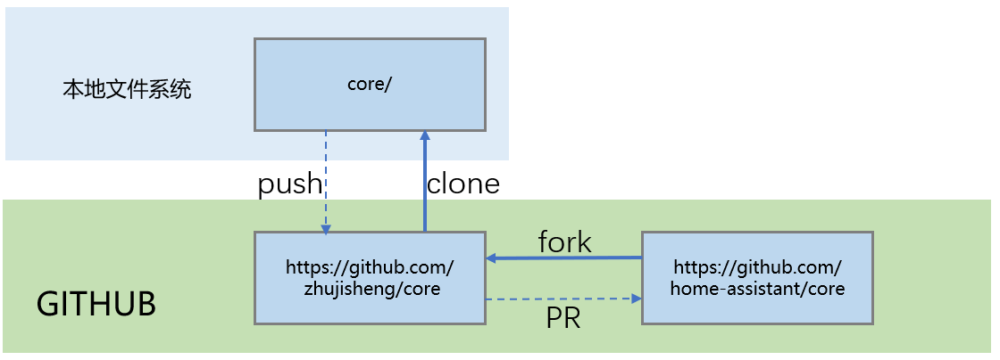

# 程序调试(1)

## 日志输出

```python
import logging
_LOGGER = logging.getLogger(__name__)
_LOGGER.debug("日志内容")
```

```yaml
# configuration.yaml
logger:
  default: warning
  logs:
    custom_components.hachina_example1: debug
    homeassistant.components.mqtt: debug
```

特点：
- 简单
- 直接在生产环境中完成
- 不能单步调试
- 不能查看非输出变量的值
- 过程中不能自由改变变量的值

## 调试准备：在Windows下安装WSL2

如果你使用Windows操作系统进行开发调试，需要先[安装`WSL2`](https://docs.microsoft.com/zh-cn/windows/wsl/install-win10#manual-installation-steps)。因为HomeAssistant在Windows中直接运行存在一系列的问题。

## 构建本地源代码仓库

*通常的做法是先将[官方的homeassistant core仓库](https://github.com/home-assistant/core)fork到自己的账户下，然后再将它clone到本地*
    


- fork

    在github网站上完成

- clone

    `git clone https://github.com/YOUR_GIT_USERNAME/core.git`

    本地为Windows和MacOS系统，也可以使用图形界面的[Github Desktop](https://desktop.github.com/)

## HomeAssistant运行环境

- 安装必要的支持

    - Linux（或者Windows WSL）

        `sudo apt-get update`

        `sudo apt-get install python3-pip python3-dev python3-venv autoconf libssl-dev libxml2-dev libxslt1-dev libjpeg-dev libffi-dev libudev-dev zlib1g-dev pkg-config libavformat-dev libavcodec-dev libavdevice-dev libavutil-dev libswscale-dev libavresample-dev libavfilter-dev ffmpeg`

    - MacOS

        `brew install python3 autoconf ffmpeg`

- 安装HomeAssistant

    `script/setup`

- 正常启动HomeAssistant

    `source venv/bin/activate`

    `hass -c config`

- 自定义集成

    如果开发的是自定义集成，将集成程序放置在`core/config/custom_components/`目录


## 传统的pdb调试方法

- 进入python虚拟环境

    `source venv/bin/activate`

- 手工启动hass

    - `python3 -m pdb venv/bin/hass -c config`

    - 或在源程序中加入：

        ```python
        import pdb
        pdb.set_trace()
        ```

        启动命令：`hass -c config`

- 常用的pdb命令

    + `break`或`b`       设置断点
    + `continue`或`c`    继续执行程序
    + `list`或`l`        查看当前行的代码段
    + `step`或`s`        进入函数
    + `return`或`r`      执行代码直到从当前函数返回
    + `exit`或`q`        中止并退出
    + `next`或`n`        执行下一行
    + `pp`               打印变量的值
    + `help`             帮助

