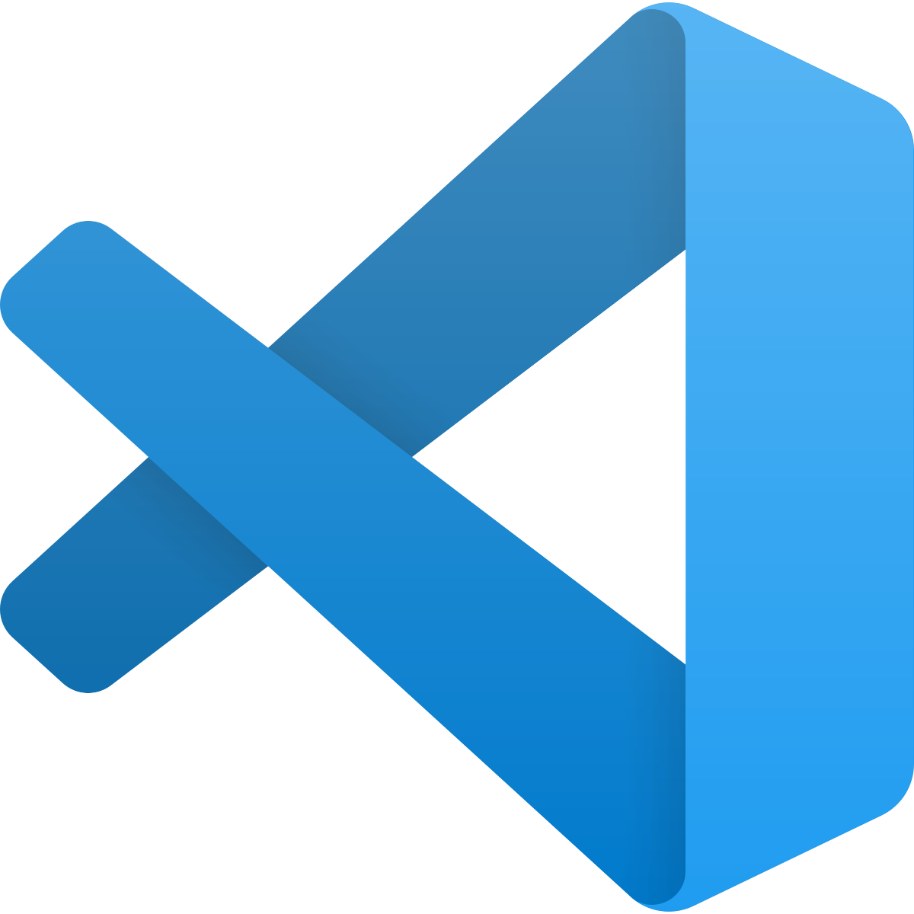
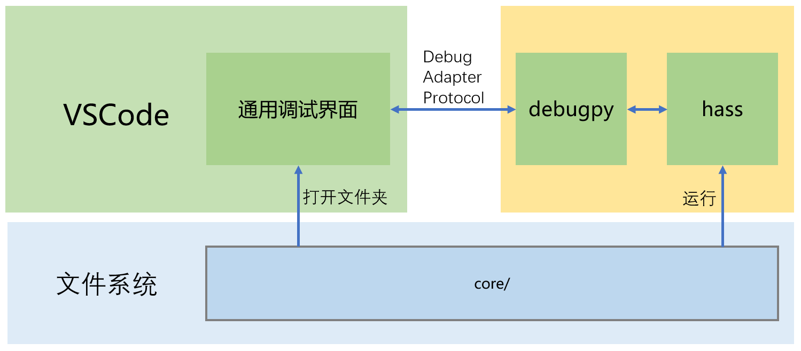
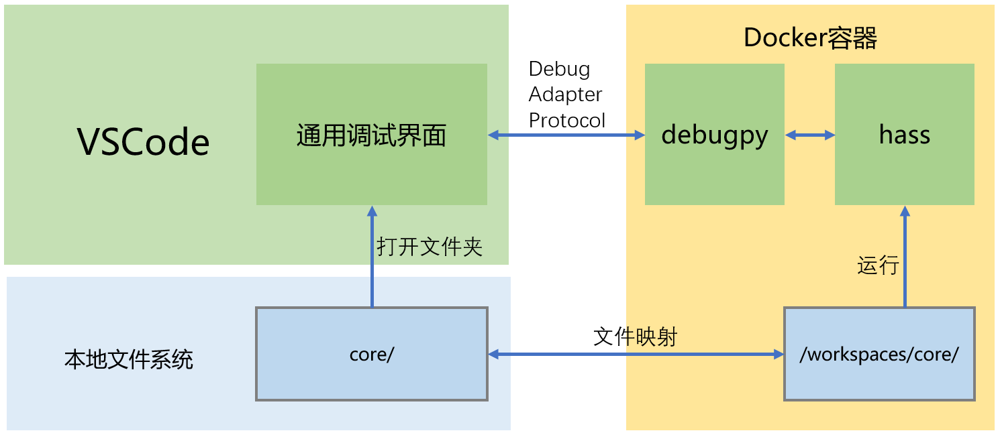

# 程序调试(2)

## VSCode



安装[Visual Studio code](https://code.visualstudio.com/)

## debugpy

*这种方式，需要先完成上个视频中"构建本地源代码仓库"和"HomeAssistant运行环境"工作*



- 进入python虚拟环境

    `source venv/bin/activate`

- 安装debugpy

    - `pip install debugpy`

- 启动debugpy

    - `python -m debugpy --listen localhost:5678 --wait-for-client -m homeassistant -c config`

    - 或者，在`configuration.yaml`中配置：

        ```
        debugpy:
          start: true
          wait: true
        ```

        启动命令：`hass -c config`

- 在VSCode调试界面中，通过`HomeAssistant: Attach Local`开始调试

    参考`code/.vscode/launch.json`文件

## devcontainer

*这种方式，需要先完成上个视频中"构建本地源代码仓库"工作，但不必完成其中的"HomeAssistant运行环境"，因为HomeAssistant将运行在docker容器中*



#### 软件安装与配置

- docker环境

    - Linux下安装

        `curl -fsSL https://get.docker.com -o get-docker.sh`

        `sh get-docker.sh`

        `sudo usermod -aG docker 用户名`   将用户加入docker用户组

    - [Windows与MacOS安装Docker Desktop](https://docs.docker.com/engine/install/)

        注：如果是window10 Home操作系统，需要先[安装WSL2](https://docs.microsoft.com/zh-cn/windows/wsl/install-win10#manual-installation-steps)

- VSCode扩展Remote-Containers

    - 安装[VSCode扩展插件Remote-Containers](https://marketplace.visualstudio.com/items?itemName=ms-vscode-remote.remote-containers)

    - 打开core目录，自动构建docker容器：

        `View`-`Command Palette...`-`Remote-Containers: Open Folder in Container...`

        参考`core/Dockerfile.dev`文件

#### 调试(操作与前面相同)

- 启动

    - `python -m debugpy --listen localhost:5678 --wait-for-client -m homeassistant -c config`

    - 或者，在`configuration.yaml`中配置：

        ```
        debugpy:
          start: true
          wait: true
        ```

        启动命令：`hass -c config`

- 在VSCode调试界面中，通过`HomeAssistant: Attach Local`开始调试

    参考`code/.vscode/launch.json`文件