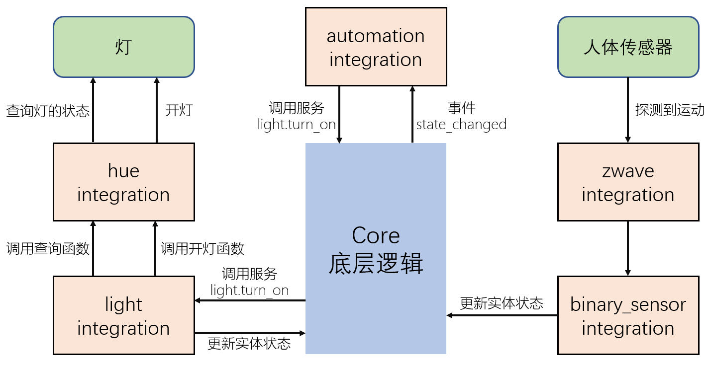

# 平台(platform)

## 理解平台概念



平台：当集成接入的设备，属于某种通用类型时，可以通过创建平台简化其开发

常见的通用类型：

- `alarm_control_panel`：报警控制面板
- `air_quality`：空气净化器
- `binary_sensor`：开关型传感器
- `climate`：空调
- `cover`：窗帘
- `device_tracker`：位置跟踪
- `fan`：风扇
- `lock`：智能锁
- `sensor`：传感器
- `light`：智能灯
- `switch`：智能开关
- `camera`：摄像头
- `media_player`：媒体播放器
- `image_processing`：图像处理
- `remote`：无线遥控设备
- `weather`：天气状况
- ……

*绝大多数的设备接入，都可以通过在集成中创建平台来简化开发*
 

## 平台程序

- 代码位置

    集成的平台逻辑代码，放置在该集成目录下的`X.py`文件中(X是平台对应的通用设备类型)
    
    例：[基于xiaomi_miio协议的`device_tracker`、`fan`、`light`、`remote`、`sensor`、`switch`、`vacuum`](https://github.com/home-assistant/core/tree/dev/homeassistant/components/xiaomi_miio)

- 基础类

    代码中一般会实现一个从基础类继承的类

    基础类：
    - `homeassistant.components.sensor.SensorEntity`
    - `homeassistant.components.media_player.MediaPlayerEntity`
    - `homeassistant.components.light.LightEntity`
    - `homeassistant.components.climate.ClimateEntity`
    - ……

    参考：[https://github.com/home-assistant/core/tree/master/homeassistant/components/demo](https://github.com/home-assistant/core/tree/master/homeassistant/components/demo)

    官方文档：[https://developers.home-assistant.io/docs/core/entity](https://developers.home-assistant.io/docs/core/entity)

## 配置与加载

1. 在类型域中配置（`configuration.yaml`）

    [样例程序](custom_components/example_load_platform1/)

    ```yaml
    sensor:
      - platform: example_load_platform1
        name: abc
        value: 23.33
    ```

    - 流程入口:`(async_)setup_platform`

        + 配置被加载时，自动调用此函数
        + 配置内容通过'config'参数传入
        + 在此函数中通过传入的`(async_)add_entities`函数加载设备

2. 在集成域中配置（`configuration.yaml`）

    [样例程序](custom_components/example_load_platform2/)

    ```yaml
    example_load_platform2:
        sensor:
            name: abc
            value: 25.55
    ```

    - 流程入口：`(async_)setup`

        + 在此函数中调用`hass.helpers.discovery.(async_)load_platform`函数

    - `(async_)setup_platform`

        + 调用`hass.helpers.discovery.(async_)load_platform`函数后，自动启动此函数
        + 配置内容可通过`discovery_info`参数传入
        + 在此函数中，通过传入的`(async_)add_entities`函数加载设备

3. 前端配置

    [样例程序](custom_components/example_load_platform3/)

    - 流程入口：`async_setup_entry`
        + 在此函数中调用`hass.config_entries.async_forward_entry_setup`函数

    - `async_setup_entry`

        + 调用`hass.config_entries.async_forward_entry_setup`函数后，自动启动此函数
        + 配置信息通过`config_entry`参数传入
        + 在此函数中，通过传入的`async_add_entities`函数加载设备

*以上三种方式并不互斥，可以同时实现*