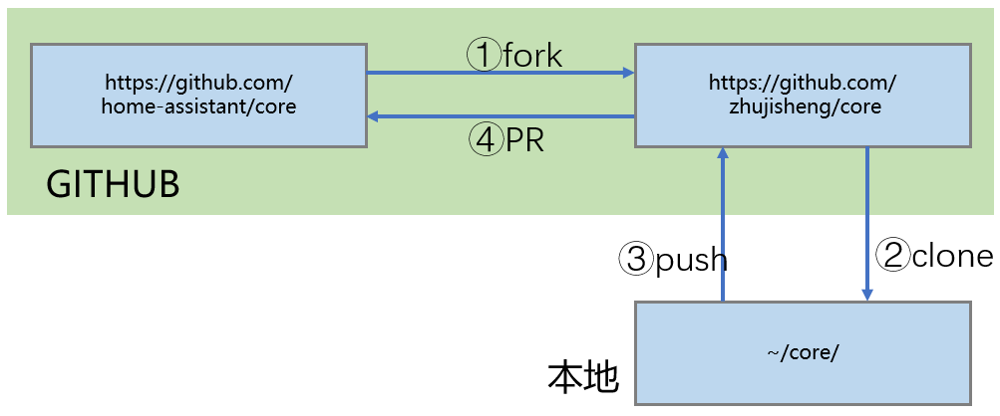

# 把你的代码贡献给组织

## 操作步骤
1. fork home-assistant项目
2. 构建本地开发环境
3. 本地库修改与测试
4. 提交你的贡献
5. 提交网站文档修改

## 参考

- git工具的介绍

    [https://www.liaoxuefeng.com/wiki/896043488029600](https://www.liaoxuefeng.com/wiki/896043488029600)

- HomeAssistant开发者指导

    [https://developers.home-assistant.io/docs/en/development_index.html](https://developers.home-assistant.io/docs/en/development_index.html)

- 核心过程

    
 
- 构建开发环境命令

    + 安装基础软件库

        ```sh
        sudo apt update
        sudo apt-get install python3-pip python3-dev python3-venv autoconf libssl-dev libxml2-dev libxslt1-dev libjpeg-dev libffi-dev libudev-dev zlib1g-dev pkg-config libavformat-dev libavcodec-dev libavdevice-dev libavutil-dev libswscale-dev libavresample-dev libavfilter-dev ffmpeg
        ```

    + 创建/进入开发目录

        ```sh
        mkdir my_development
        cd my_development
        ```

    + 克隆远程库

        ```sh
        git clone https://github.com/YOUR_GIT_USERNAME/core.git
        cd core
        git remote add upstream https://github.com/home-assistant/core.git
        ```

    + 构建python虚拟环境，从源码安装HomeAssistant

        `script/setup`

- 修改与本地测试（以增加`image_processing.qrcode`为例）

    - 创建工作分支

        `git checkout -b qrcode`

    - 修改

        ```sh
        # 编辑组件程序
        vi homeassistant/components/qrcode/image_processing.py
        vi ......

        # 生成新的requirements_all.txt
        script/gen_requirements_all.py
        ```

    - 代码规范检查

        ```sh
        pip3 install -r requirements_test.txt
        flake8 homeassistant/components/qrcode/image_processing.py
        pydocstyle homeassistant/components/qrcode/image_processing.py
        pylint homeassistant/components/qrcode/image_processing.py
        ```

    - 完整测试

        `tox`

        *tox命令，运行时间非常长*

    - 确认修改

        ```sh
        git add .
        git commit -m "Added some-feature" --amend --author="YourName <youremail@xxx.xxx>"
        ```

- 提交你的贡献

    + 获取最新官方版本内容  

        ```sh
        git fetch upstream dev  # 获取官方的当前分支
        git rebase upstream/dev # 调基
        ```

    + 将修改发布到你fork的项目中

        `git push origin HEAD`

    + 创建Pull Request（在github网站上进行）

        本视频中创建的PR链接：[https://github.com/home-assistant/core/pull/20215](https://github.com/home-assistant/core/pull/20215)
