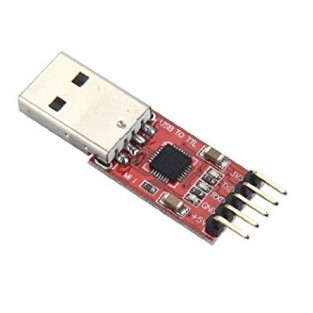

# NB-IOT

## 硬件准备
- Sim7000模块或其它NB-IOT模块
- nb-iot流量sim卡
- USB-TTL连接线

## 操作步骤

1. nb-iot与gprs比较
2. 模块硬件连接

    

3. 网络连接操作
4. tcp通讯操作
5. 卫星定位操作

## 参考

- 一些常用的Sim7000模块AT指令

    - `AT`，通讯探测
    - `AT+CSQ`，获得信号强度。
    - `AT+CPIN?`，检查sim卡是否准备好
    - `AT+CNMP=38`，选择LTE网络，也就是4g网络（nb-iot相关命令）
    - `AT+CMNB=2`，选择nb-iot网络（nb-iot相关命令）
    - `AT+NBSC=1`，打开扰码（nb-iot相关命令）
    - `AT+CNMP=13`，选择gprs网络（grps相关命令）
    - `AT+CREG?`，查询网络注册情况（grps相关命令）
    - `AT+COPS?`，查询运营商情况
    - `AT+CGATT?`，检查网络附着状态
    - `AT+CGNAPN`，检查可用的APN（grps相关命令）
    - `AT+CSTT="xxxx"`，设置APN（移动gprs固定为"CMNET"）
    - `AT+CIICR`，建立无线链路
    - `AT+CIFSR`，获得本机ip地址
    - `AT+CDNSGIP=www.baidu.com`，查询百度的ip地址
    - `AT+CIPSHUT`，关闭无线链路

    tcp通讯命令

    - `AT+CIPSTART="TCP","120.25.224.249",9999`
    - `AT+CIPSEND`，开始发送数据（要多次发送，需多次输入此命令），以0x1A结束
    - `AT+CIPCLOSE`，关闭tcp连接

    卫星定位命令

    - `AT+CGNSPWR=1`，打开GNSS电源
    - `AT+CGNSINF`，获得卫星定位信息
    - `AT+CGNSPWR=0`，关闭GNSS电源
