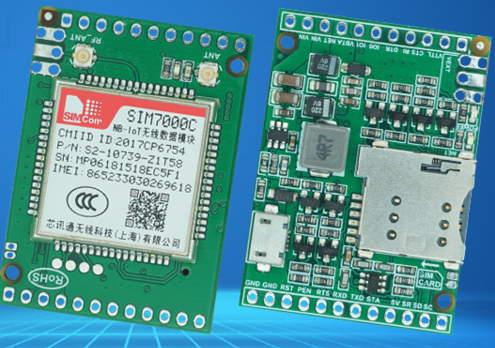
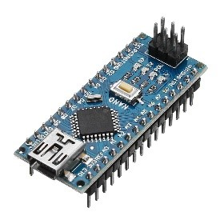
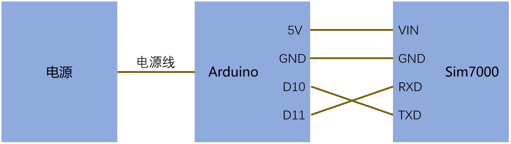
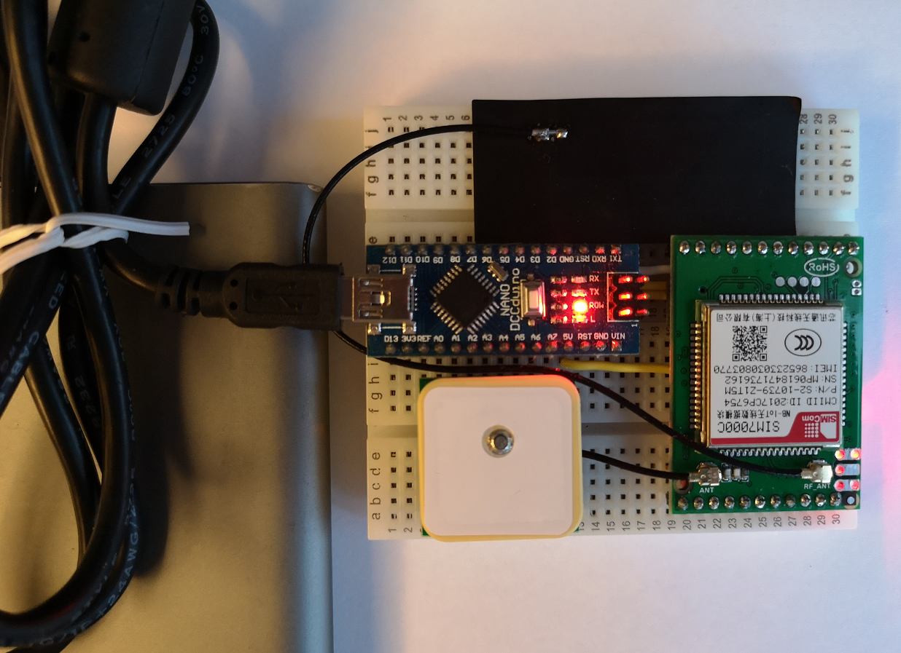

# 车载定位(2)—车载设备diy

## 硬件准备
- Sim7000模块
- Arduino开发板
- nb-iot sim卡

    

## 操作步骤

1. 固件程序

    [LocReport](LocReport/)

2. 硬件连接

    

    

3.  程序修改、编译与upload
4.  效果

## 参考

- 下载github项目子目录的工具页面

    [https://minhaskamal.github.io/DownGit/#/home](https://minhaskamal.github.io/DownGit/#/home)
