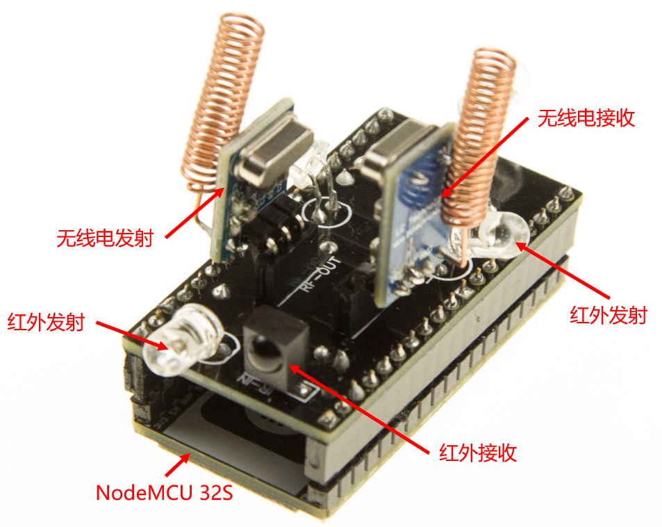
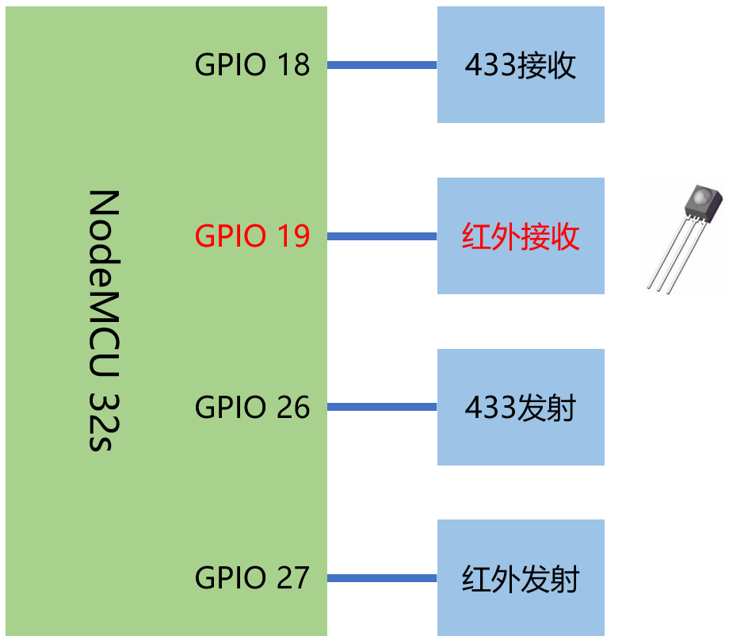

# 使用红外与无线模块(1)-红外接收

## 硬件



## 操作步骤

1. 红外接收配置

  ```yaml
  remote_receiver:
    - pin: 
        number: GPIO19
        inverted: yes
      dump: all
      id: ir_receiver
  ```

2. 接收红外信号
3. 理解`raw`格式的红外编码
4. 配置开关型传感器（红外接收）

  ```yaml
  binary_sensor:
    - platform: remote_receiver
      name: "Sony电视开关按钮"
      sony:
        data: 0x00000A90
        nbits: 12
      filters:
        delayed_off: 300ms
    - platform: remote_receiver
      name: "Sharp电视开关按钮"
      raw:
        code: [334, -1765, …]
      filters:
        delayed_off: 300ms
  ```

## 参考

- 编码图形查看

  [https://test.sui.li/oszi/](https://test.sui.li/oszi/)

- sharp遥控器编码协议

  [https://www.sbprojects.net/knowledge/ir/sharp.php](https://www.sbprojects.net/knowledge/ir/sharp.php)

- esphome中的Remote Receiver

  [https://esphome.io/components/remote_receiver.html](https://esphome.io/components/remote_receiver.html)

- esphome使用相关视频

  + 《ESPHome》篇章

  + 精彩众创中名字以`ESPHome-`开头的视频
 
