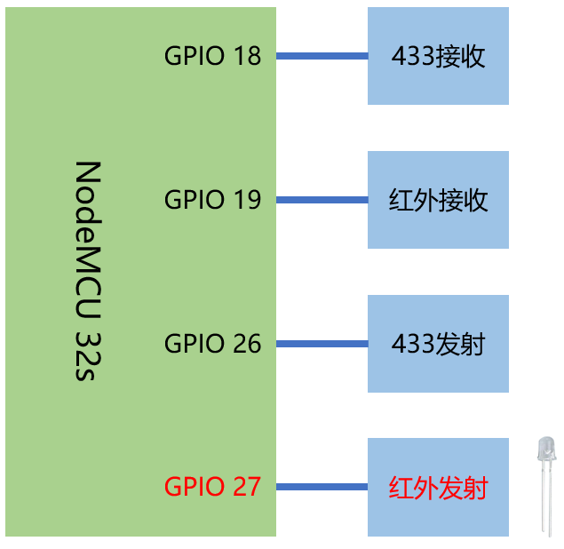

# 使用红外与无线模块(2)-红外发射

## 硬件



## 操作步骤
1. 配置红外开关（红外发射）

  ```yaml
  remote_transmitter:
    - pin: GPIO27
      carrier_duty_percent: 50%
      id: ir_sender

  switch:
    - platform: template
      name: "Sony电视开关"
      turn_on_action:
        - remote_transmitter.transmit_sony:
            transmitter_id: ir_sender
            data: 0x00000A90
            nbits: 12
    - platform: template
      name: "Sharp电视开关"
      turn_on_action:
        - remote_transmitter.transmit_raw:
            transmitter_id: ir_sender
            carrier_frequency: 38kHz
            code: [293, -1806, 292, -757, 291, -759, 292, -758, 317, -734, 292, -758, 291, -1686, 414, -1750, 373, -732, 293, -1706, 392, -757, 293, -757, 293, -757, 294, -1727, 373, -757, 292]
        - delay: 40ms
        - remote_transmitter.transmit_raw:
            transmitter_id: ir_sender
            carrier_frequency: 38kHz
            code: [292, -1805, 305, -745, 317, -732, 293, -757, 293, -758, 293, -1805, 295, -756, 294, -755, 316, -1782, 294, -756, 294, -1807, 291, -1807, 292, -1807, 319, -730, 293, -1806, 318]
  ```

2. 配置HomeAssistant中的服务（红外发射）

  ```yaml
  api:
    services:
      - service: toggle_sony_tv
        then:
          - remote_transmitter.transmit_sony:
              transmitter_id: ir_sender
              data: 0x00000A90
              nbits: 12
      - service: toggle_sharp_tv
        then:
          - remote_transmitter.transmit_raw:
              transmitter_id: ir_sender
              carrier_frequency: 38kHz
              code: [293, -1806, 292, -757, 291, -759, 292, -758, 317, -734, 292, -758, 291, -1686, 414, -1750, 373, -732, 293, -1706, 392, -757, 293, -757, 293, -757, 294, -1727, 373, -757, 292]
          - delay: 40ms
          - remote_transmitter.transmit_raw:
              transmitter_id: ir_sender
              carrier_frequency: 38kHz
              code: [292, -1805, 305, -745, 317, -732, 293, -757, 293, -758, 293, -1805, 295, -756, 294, -755, 316, -1782, 294, -756, 294, -1807, 291, -1807, 292, -1807, 319, -730, 293, -1806, 318]
  ```

## 参考

- esphome中的Remote Transmitter

  [https://esphome.io/components/remote_transmitter.html](https://esphome.io/components/remote_transmitter.html)

- esphome中的Api Service

  [https://esphome.io/components/api.html#user-defined-services](https://esphome.io/components/api.html#user-defined-services)

- sharp遥控器编码协议

  [https://www.sbprojects.net/knowledge/ir/sharp.php](https://www.sbprojects.net/knowledge/ir/sharp.php)
