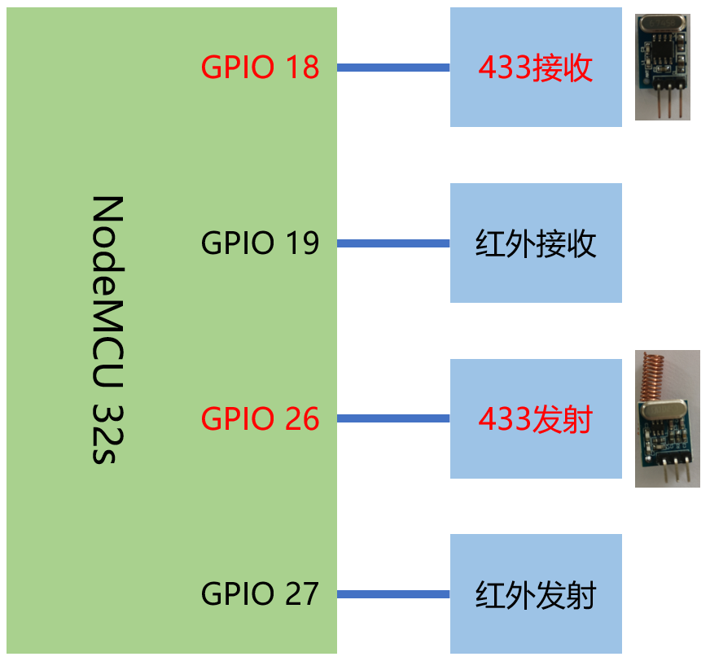

# 使用红外与无线模块(3)-无线收发

## 硬件



## 操作步骤

1. 无线控制信号编码范式

  - 最常用的编码方式：[https://github.com/sui77/rc-switch/wiki/KnowHow_LineCoding](https://github.com/sui77/rc-switch/wiki/KnowHow_LineCoding)

  - esphome中的定义代码： 

    [https://github.com/esphome/esphome/blob/dev/esphome/components/remote_base/rc_switch_protocol.cpp](https://github.com/esphome/esphome/blob/dev/esphome/components/remote_base/rc_switch_protocol.cpp)

2. 无线发射配置

  ```yaml
  remote_transmitter:
    - pin: GPIO26
      carrier_duty_percent: 100%
      id: rf_sender

  switch:
    - platform: template
      name: "test1"
      turn_on_action:
        - remote_transmitter.transmit_rc_switch_raw:
            transmitter_id: rf_sender
            code: '0101010101111'
            protocol: 1
            repeat:
              times: 3
              wait_time: 50ms
    - platform: template
      name: "test2"
      turn_on_action:
        - remote_transmitter.transmit_rc_switch_raw:
            transmitter_id: rf_sender
            code: '0101010101111'
            protocol:
              pulse_length: 350
              sync: [1,31]
              zero: [1, 3]
              one: [3, 1]
            repeat:
              times: 3
              wait_time: 50ms
  ```

3. 无线接收

  ```yaml
  remote_receiver:
    - pin: 
        number: GPIO18
        inverted: no
        mode: INPUT_PULLDOWN
      dump: rc_switch
      id: rf_receiver
  ```

4. 使用原始（raw）信号

  - 为什么要使用raw信号：在接收解析中，`rc_switch`仅解析协议1-7，一些设备的信号并不完全符合这7个协议

  - 难度：杂波与干扰

  - 解决：将raw信号画成图形，人工判断协议与传输的信息 
