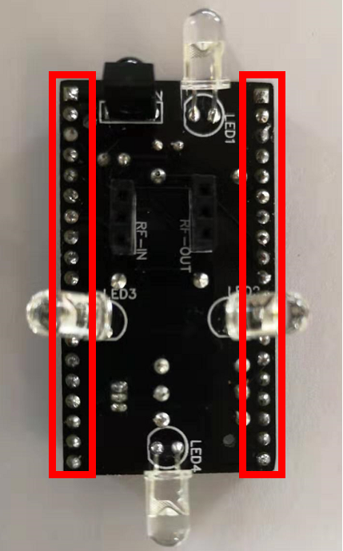
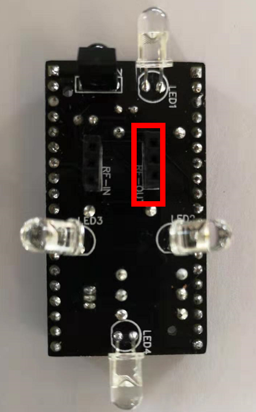
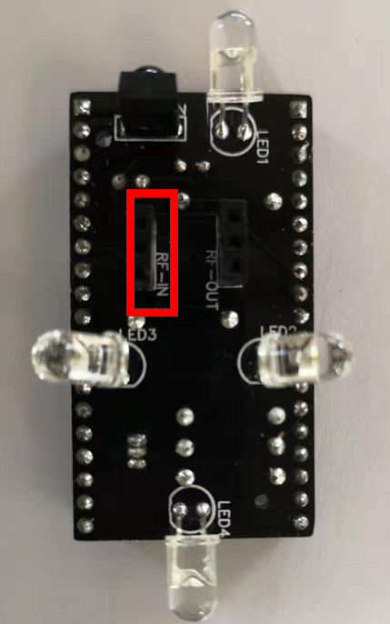
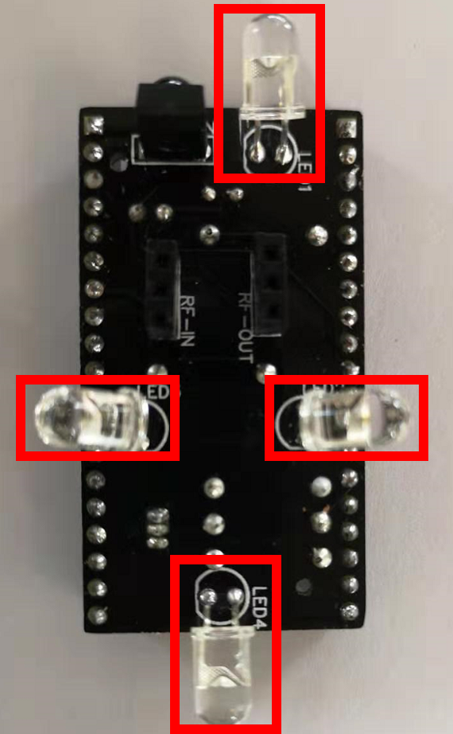
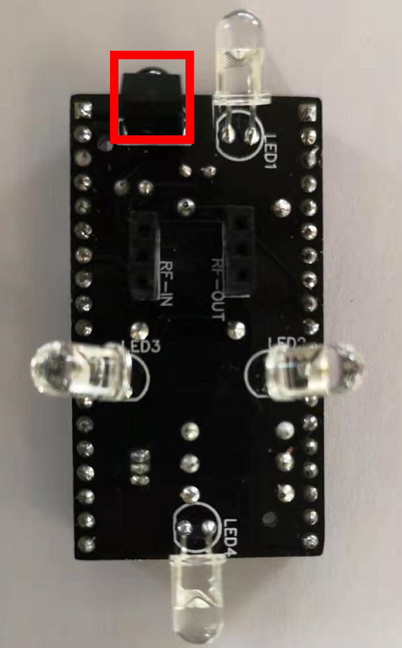

# 硬件制作(1)-画电路图

# 操作步骤

1. EDA软件

    Altium Designer: [https://www.altium.com/altium-designer/](https://www.altium.com/altium-designer/)

    EasyEDA: [https://easyeda.com/](https://easyeda.com/)

    EasyEDA中文：[https://lceda.cn](https://lceda.cn)

2. 登录、创建新的项目

    [https://easyeda.com/zhujisheng/hong-wai-yu-wu-xian-mu-kuai](https://easyeda.com/zhujisheng/hong-wai-yu-wu-xian-mu-kuai)

    或[https://easyeda.com/zhujisheng/test](https://easyeda.com/zhujisheng/test)

3. 创建Schemetic（电路图）

4. 画电路图

    *注意：每个元器件可以选择错误的型号与参数，但必须选择正确的尺寸*

    - 设计NodeMcu32S的对插连接器

        

    - 设计无线发射模块的连接器

        

    - 设计无线接收模块的连接器

        

    - 设计红外发射管电路

        

    - 设计红外接收管电路

        

