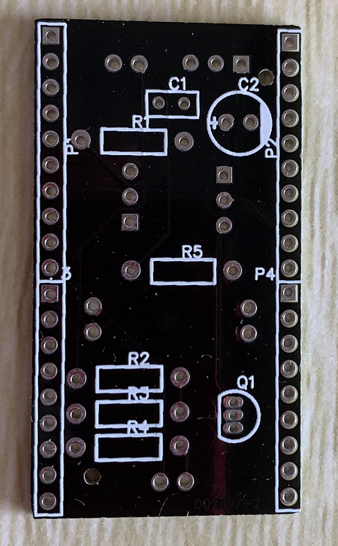
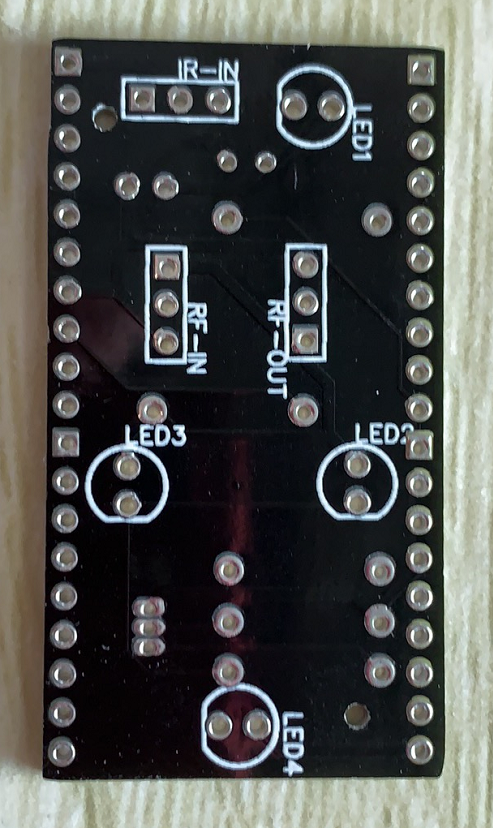

# 硬件制作(2)-画PCB板

## 操作步骤

1. 将电路图转换成PCB布线图

    设置PCB板的形状、大小、层数

2. 元器件部署

    与esp32的连接器（正面）

    红外发射led、红外接收器（反面）

    无线发射与无线接收连接器（反面）

    部署电阻、电容、三极管等元器件（正面）

3. 布线

4. 印刷文字

5. 导出文件

6. 寻找加工厂

     

