# 硬件制作(3)-元器件与焊接

# 操作步骤
1. BOM表

    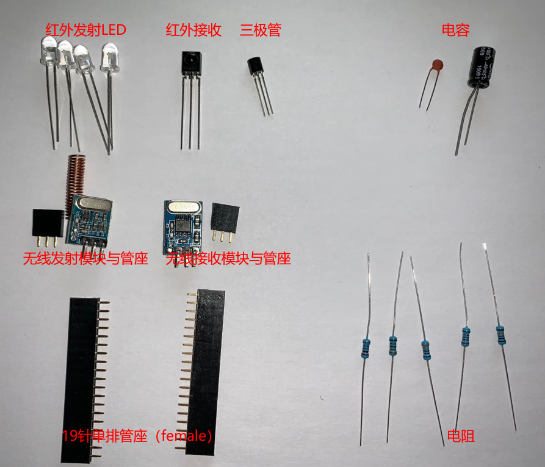

    | 类型 | 设计文件中名称 | 元器件 | 数量 | 备注 |
    | -- | -- | -- | :--: | -- |
    | Header管座 | J1、J2、P1、P2 | Header-Female-2.54_1x19 | 2 | 19针2.54间距排针母座 |
    | Header管座 | RF-OUT、RF-IN | Header-Female-2.54_1x3 | 2 | 3针2.54间距排针母座 |
    | 红外模块 | LED1-4 | IR-Infrared-LED-5mm | 4 | 5MM的红外发射管 |
    | 红外模块 | IR-IN | IRM-56384 | 1 | 红外接收管 |
    | 无线模块 | -- | SYN115 | 1 |  射频发射模块（433M或315M） |
    | 无线模块 | -- | SYN480R | 1 | 射频接收模块（433M或315M） |
    | 三极管 | Q1 | SS8050 | 1 | NPN型三极管 |
    | 电容 | C1 | 0.1uF-瓷片电容 | 1 | 瓷片电容 |
    | 电容 | C2 | 100uF-25V-电解电容 | 1 | 电解电容 |
    | 电阻 | R1 | 330Ω-1/4W-金属膜电阻 | 1 | 射频发射DATA端限流电阻 |
    | 电阻 | R2 | 3.3kΩ-1/4W-金属膜电阻 | 1 | 三极管基极限流电阻 |
    | 电阻 | R3 | 100kΩ-1/4W-金属膜电阻 | 1 | 三极管基极下拉电阻 |
    | 电阻 | R4 | 180Ω-1/4W-金属膜电阻 | 1 | 并联红外发射管限流电阻 |
    | 电阻 | R5 | 20kΩ-1/4W-金属膜电阻 | 1 | 红外接收DATA端上拉电阻 |

2. 锡焊直插件的标准姿势

    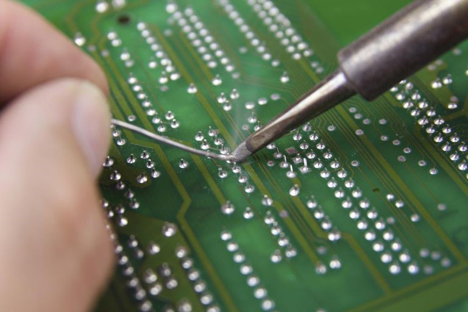

3. 焊接元器件

    - 电阻

        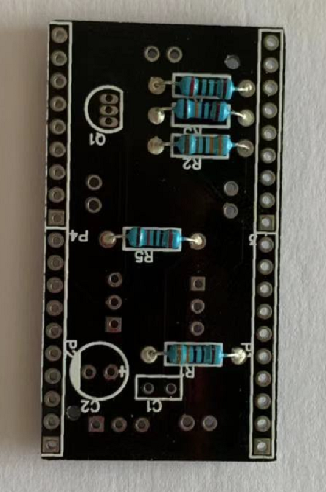 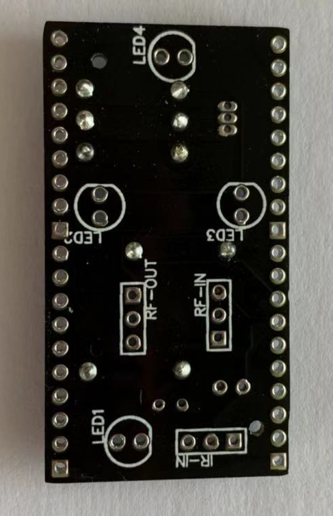

    - 电容

        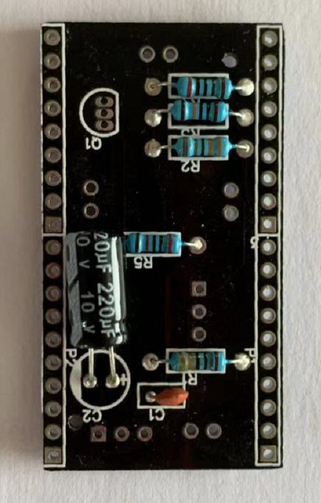 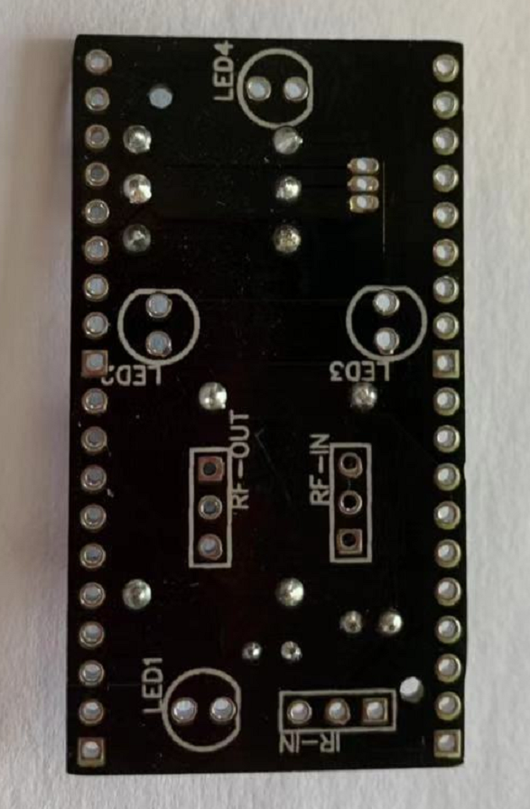

    - 三极管与红外接收管

        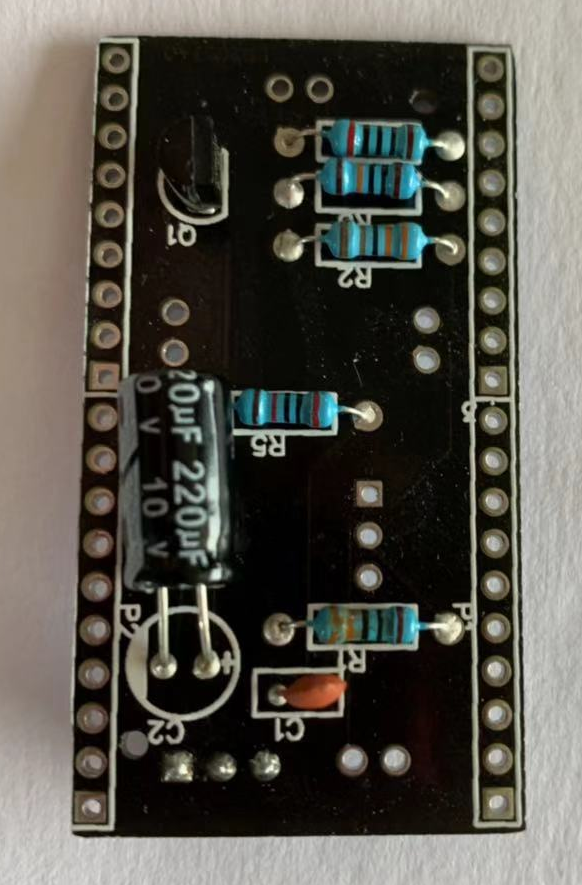 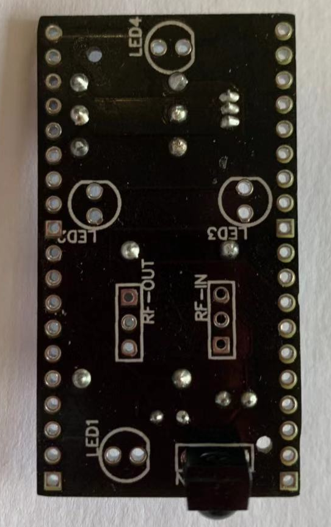

    - 红外发射LED灯

        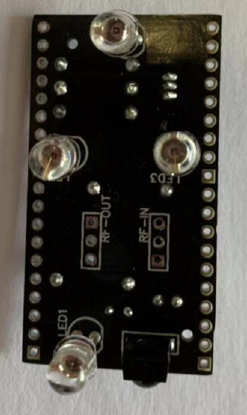 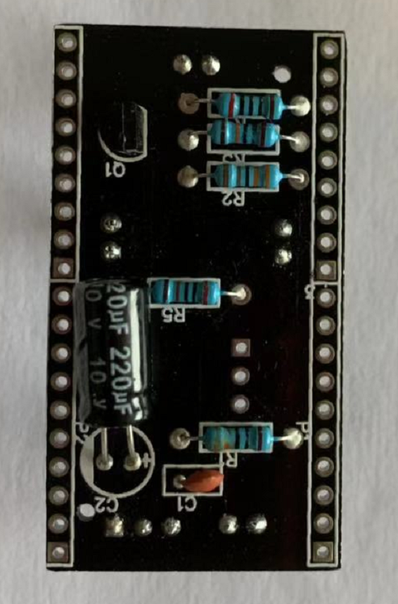

    - 无线模块管座

        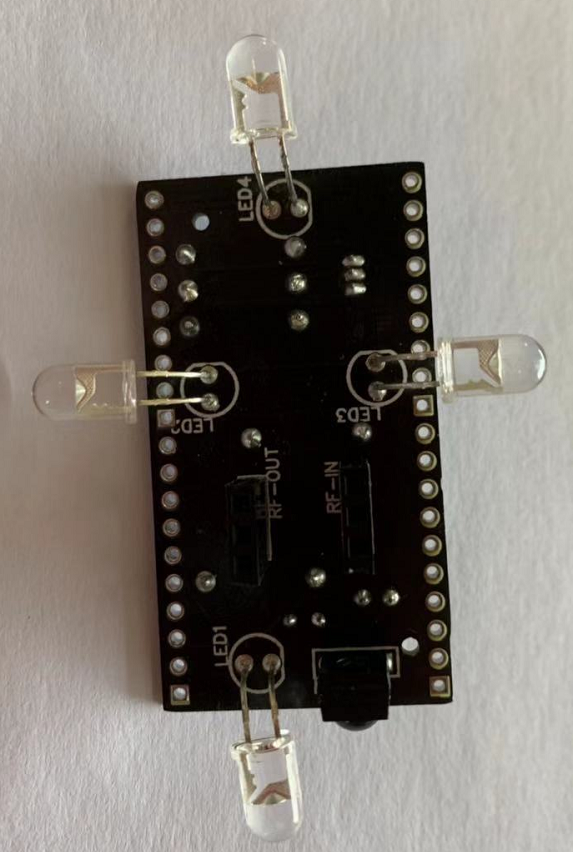 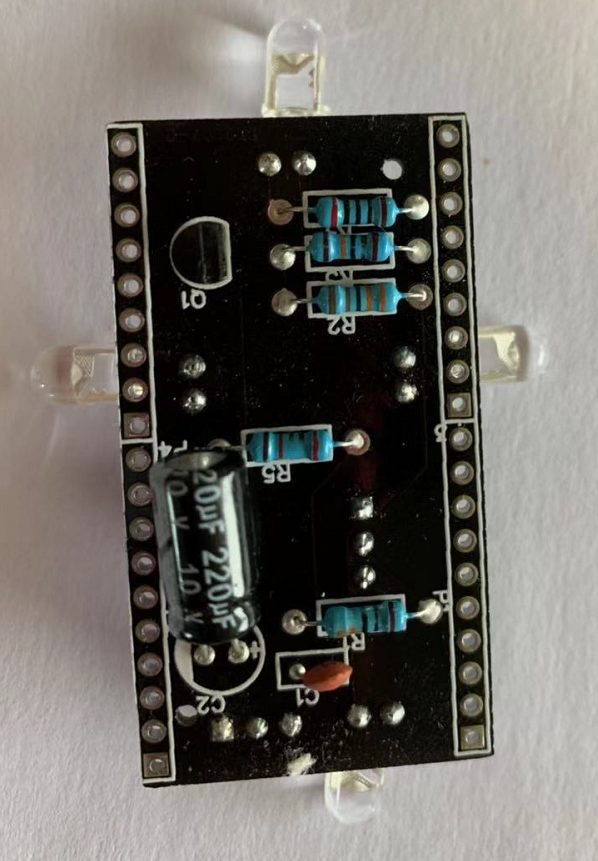

    - 与nodemcu-esp32对插管座

        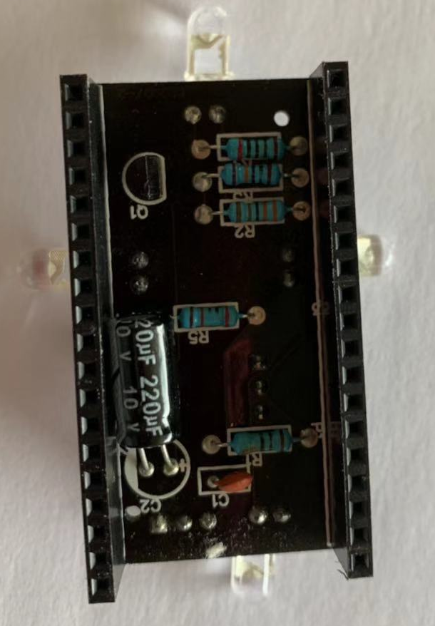 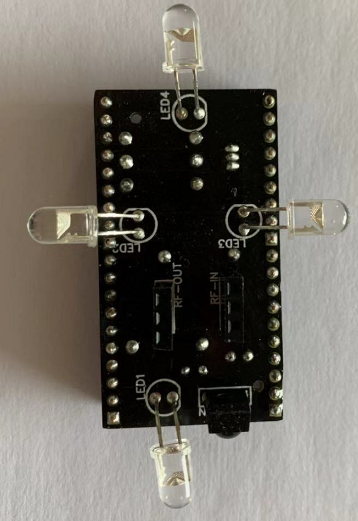

    - 成品

        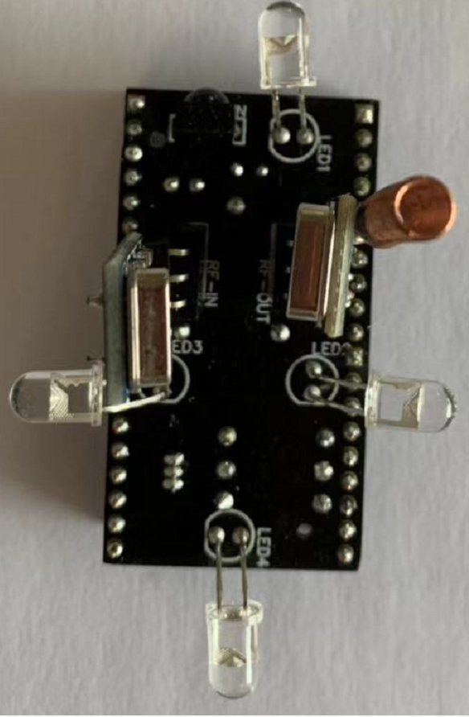 

   

## 参考

- 焊接那点事儿

    [http://www.shaoguoji.cn/2017/03/14/welding-skill/](http://www.shaoguoji.cn/2017/03/14/welding-skill/)

- 元器件的各种封装

    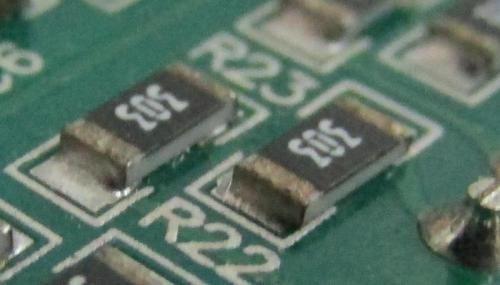 
     
    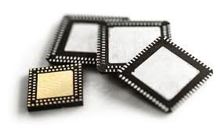
