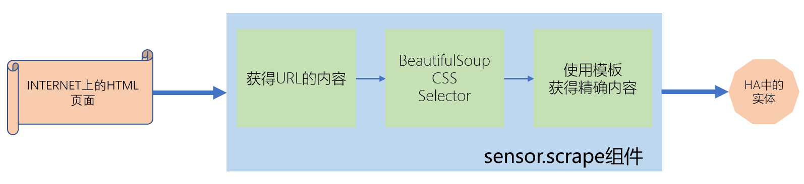

# 各种网站页面元素-使用scrape集成

## 操作步骤

1. sensor.scarpe组件的逻辑
2. 获得HomeAssistant网站上最新的版本号和组件数量
3. 使用value_template调整字符串
4. 12306火车票信息（失败）
5. 使用sensor.scarpe2组件
6. 获得淘宝商品价格

## 参考
- scrape过程

  

- sensor.scrape组件

  [https://www.home-assistant.io/integrations/scrape/](https://www.home-assistant.io/integrations/scrape/)

- BeautifulSoup CSS Selector

  [https://www.crummy.com/software/BeautifulSoup/bs4/doc/#css-selectors](https://www.crummy.com/software/BeautifulSoup/bs4/doc/#css-selectors)

- 自定义的sensor.scrape2组件

  [https://github.com/zhujisheng/HAComponent/tree/master/scrape2](https://github.com/zhujisheng/HAComponent/tree/master/scrape2)

- selenium项目

  [https://www.seleniumhq.org/](https://www.seleniumhq.org/)

- 视频中的配置样例:

  ```yaml
  sensor:
    - platform: scrape
      name: HA最新版本号
      resource: https://www.home-assistant.io
      select: ".current-version h1"
      value_template: '{{ value.split(":")[1] }}'
    - platform: scrape
      name: HA组件数量
      resource: https://www.home-assistant.io/components/
      select: 'a[href="#all"]'
      value_template: '{{ value.split("(")[1].split(")")[0] }}'
    - platform: scrape2
      name: 火车票数量
      resource: https://kyfw.12306.cn/otn/leftTicket/init?linktypeid=dc&fs=%E5%8C%97%E4%BA%AC,BJP&ts=%E4%B8%8A%E6%B5%B7,SHH&date=2019-02-12&flag=N,Y,Y
      select: '#ZY_2400000G410N'
    - platform: scrape2
      name: 淘宝商品价格
      resource: https://detail.tmall.com/item.htm?spm=a1z10.1-b-s.w15914064-15567552165.202.1b375f3bHeEALW&id=560539474778&skuId=3504541689458&scene=taobao_shop
      select: '.tm-price'
  ```
