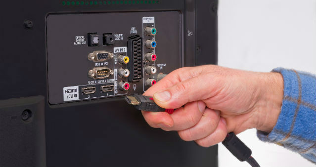
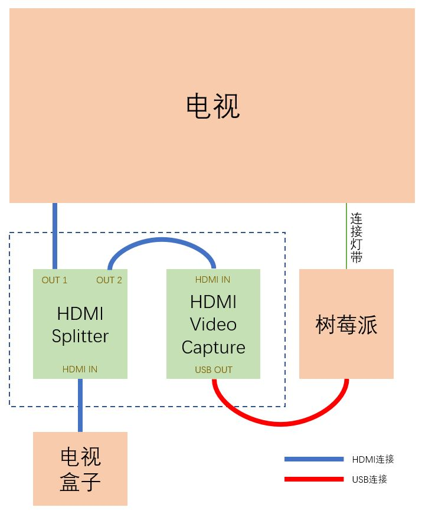
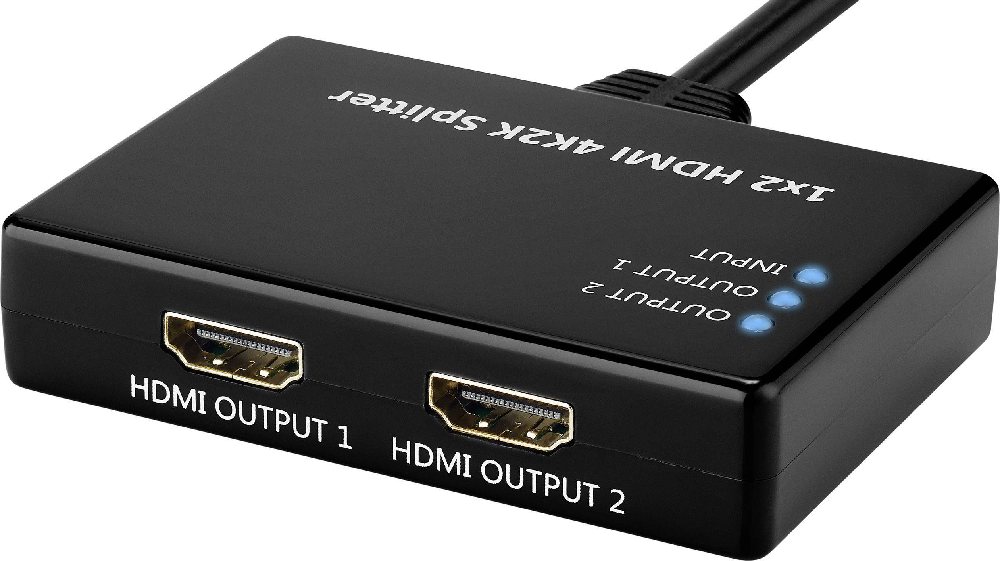
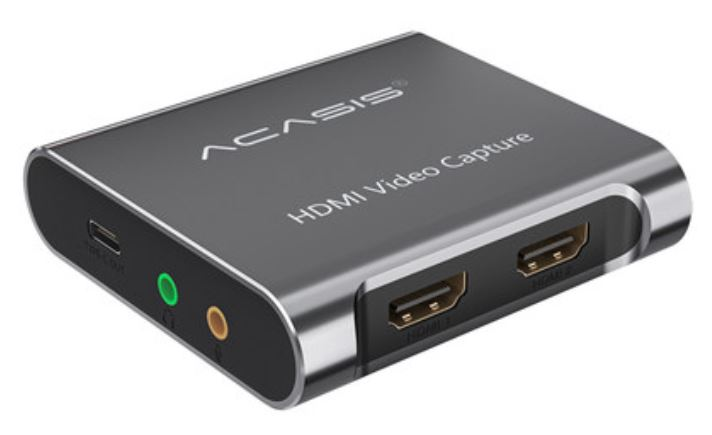
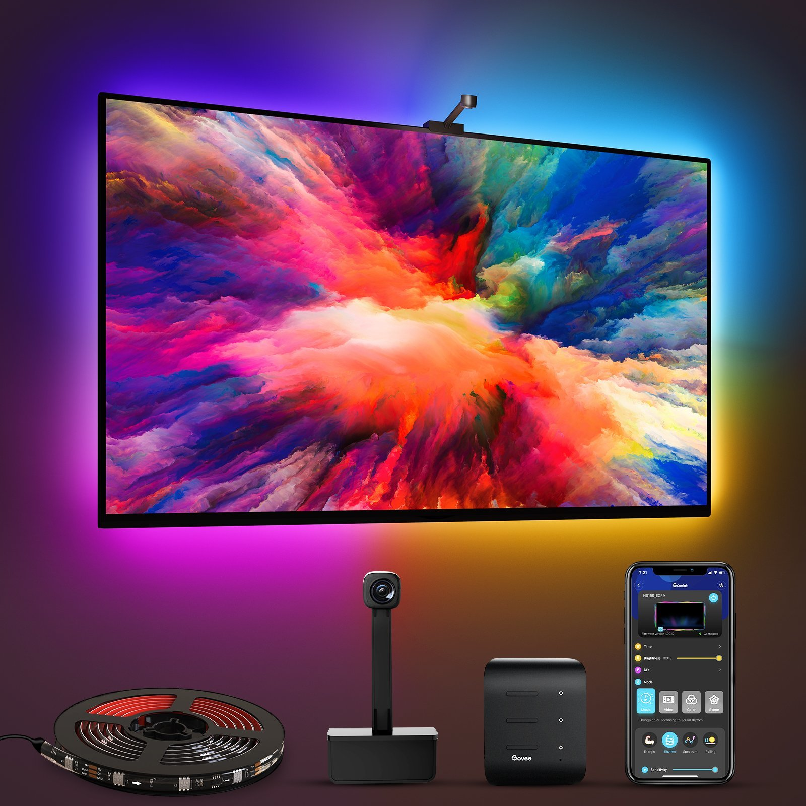

# 搭建Hyperion电视背景灯(1)

## Hyperion是什么

[https://docs.hyperion-project.org/](https://docs.hyperion-project.org/)

## 安装Hyperion

1. [软件包安装](https://docs.hyperion-project.org/en/user/Installation.html)

    [下载地址](https://github.com/hyperion-project/hyperion.ng/releases)

    Pi OS(树莓派3或者4)中安装：

    - `sudo dpkg -i Hyperion-2.0.0-alpha.10-Linux-armv7l.deb`

    - `sudo apt-get install -f`

    让hyperiond服务以`root`用户运行：

    - `sudo systemctl stop hyperiond@pi`
    - `sudo systemctl disable hyperiond@pi`
    - `sudo systemctl enable hyperiond@root`
    - `sudo systemctl start hyperiond@root`

2. HyperBian(适用于树莓派)

    [HyperBian的安装过程](https://docs.hyperion-project.org/en/user/HyperBian.html)与《安装Raspberry Pi OS》相同，仅下载的镜像文件不同

    [下载地址](https://github.com/Hyperion-Project/HyperBian/releases)

3. hassio中的Hyperion Add-on

    仓库：`https://github.com/bradsjm/hassio-addons`

    *如果你使用的是ws2812灯带，Add-on的安装方式会存在GPIO口的权限问题*

## 获得屏幕图像信号

1. HDMI Capture

    - HDMI信号线

      

    - 捕获HDMI信号

      

    - 实际设备

      

      

      *因为是使用树莓派的USB口给设备供电，所以请确保树莓派电源足够的功率*

    - 在系统中查看设备

        `v4l2-ctl --list-devices`

2. 摄像头

    参考《各种摄像头接入篇》中树莓派CSI摄像头与USB摄像头接入时要做的准备工作

    但不要实际接入HomeAssistant，因为摄像头设备只能有一个读者

    非开源的产品[govee](https://us.govee.com/products/immersion-tv-backlights)就是采用这种方案

    

3. 本机图形窗口界面

    在`Platform Capture`中进行配置
