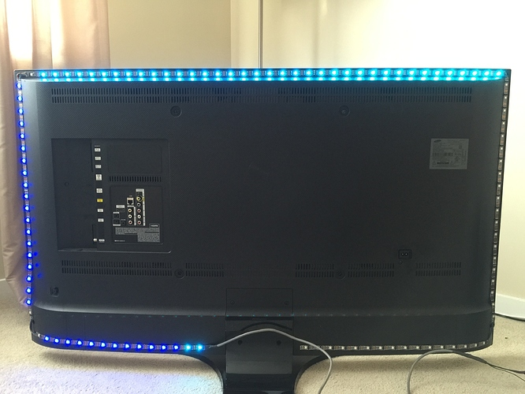
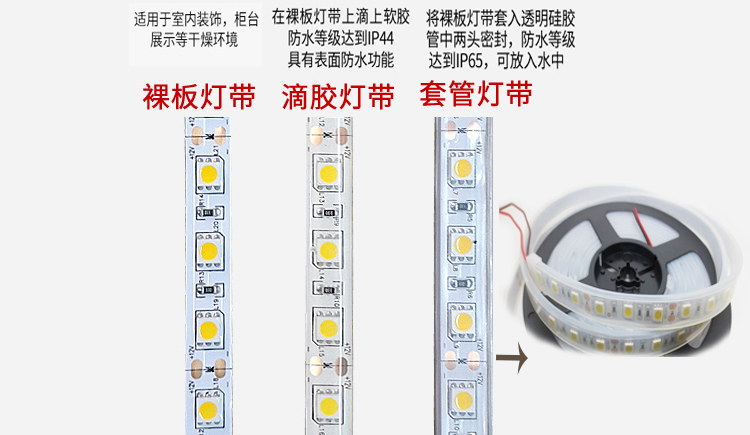
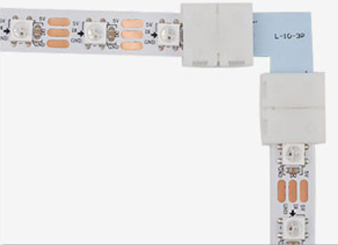
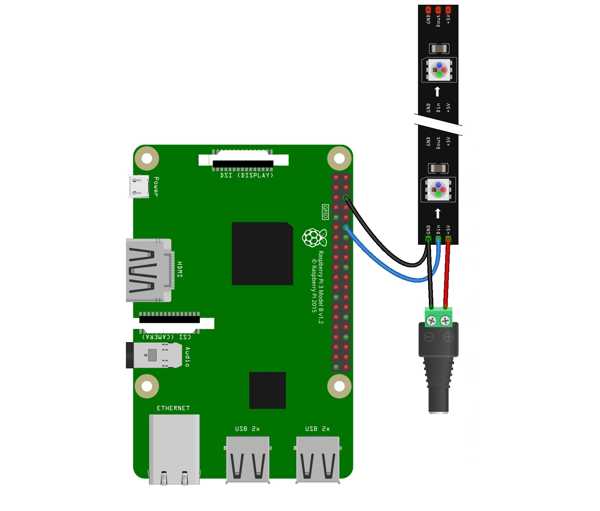

# 搭建Hyperion电视背景灯(2)

## 灯带的选择

- 型号
    * ws2812
    * apa102
    * ws2801
    * ……
- 裸板/滴胶/套管

    

    * `裸板`或`滴胶`一般带背胶，`套管`一般无背胶
    * `裸板`更方便转弯处的连接

- 长度&灯珠密度（`30/米`或`60/米`）

- 电源（变压器）

    功率：0.3*灯珠数量

- L型转角连接器

    

- 其它连接配件

## 灯带连接与配置

- ws2812连接

    

    

- RGB byte order设置

- LED布局

- SPI接口的灯带

    + 连接到Pin23(CI)与Pin19(DI)（SPI0），或者Pin40(CI)与Pin38(DI)（SPI1）
    + HassOS中注意点
        + 需要打开SPI接口

            在`config.txt`中，打开配置`dtparam=spi=on`

            参见《各种摄像头接入篇》中《树莓派CSI摄像头》，其中有如何修改`config.txt`文件

        + 在Hyperion Add-on中，仅实现了SPI0

## 输出设备(LED硬件)设置

- 常见的输出设备
    + 灯带
    + 智能灯
    + 调试文件

## 输出控制

- 输出效果
    + 颜色(Color)
    + 特效(Effect)
    + 通过硬件捕获的图像控制
        * Platform Capture
        * USB Capture

- 控制源
    + 系统设置
        * Boot Effect/Color
        * Background Effect/Color
        * Enable platform capture
        * Enable USB capture
    + 手工控制
        * WEB前端设置
        * HomeAssistant(Hyperion集成)

- 控制源选择

    + 同一时刻，可能会有多种控制源存在
    + 它们要求灯带进入不同的输出效果
    + 优先级最高（数字最小）的控制源起作用

## 获得显示器信号

