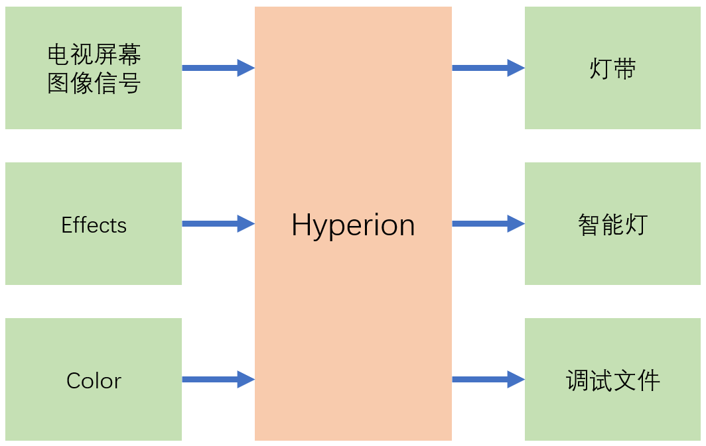

# 搭建Hyperion电视背景灯(3)

## 亮灯模式

- 通过屏幕图像信号控制灯带

    在`Configuration`/`Image Processing`中进行配置控制参数

- 特效（Effect）

    在`Effects Configurator`中编辑与增加新的特效

- 颜色（Color）

## 设置亮灯模式

- 系统设置
    * Boot Effect/Color(菜单`Configuration`/`Effects`)
    * Background Effect/Color(菜单`Configuration`/`Effects`)
    * Enable platform capture(菜单`Configuration`/`Capturing Hardware`)
    * Enable USB capture(菜单`Configuration`/`Capturing Hardware`)
- 手工控制
    * WEB前端设置(菜单`Remote Control`)
    * HomeAssistant(Hyperion集成)

- 控制源选择

    + 同一时刻，可能会有多种控制源存在
    + 它们要求灯带进入不同的亮灯模式
    + 优先级最高（数字最小）的控制源起作用

## 其它输出设备

- 常见的输出设备
    + 灯带
    + 智能灯
    + 调试文件

- 多种输出设备共存（LED Hardware Instance）

    + 每个Instance对应一个输出设备
    + 每个Instance中可以设置针对该设备的亮灯模式

## [Hyperion集成](https://www.home-assistant.io/integrations/hyperion/)
