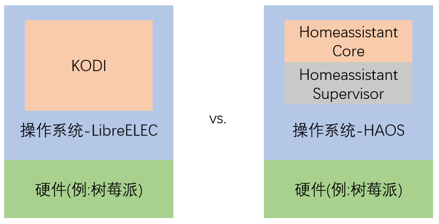
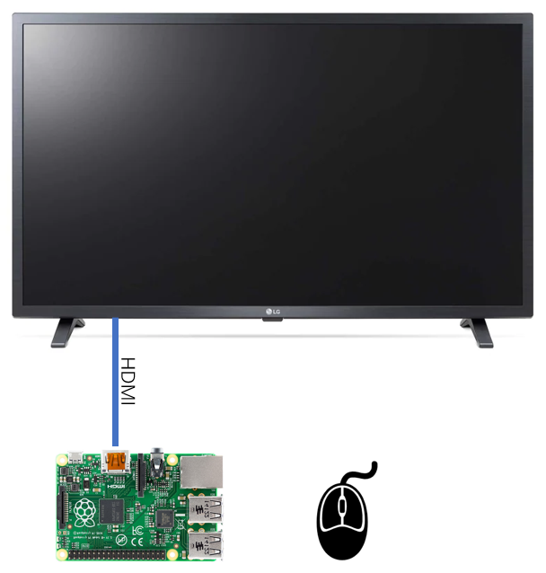

# 安装与配置LibreELEC

## Kodi与LibreELEC

- LibreELEC的理念：**Just enough OS**

- PiOS中安装Kodi(不推荐)

    + 操作系统中必须包含图形界面
    + `sudo apt-get install kodi`

- 与LibreELEC类似的操作系统还包括：
    - OSMC
    - Xbian
    - OpenELEC

## 安装LibreELEC

- 硬件选择

    推荐使用树莓派

    - 性价比合适
    - 省电
    - HDMI输出口

- 下载与安装

    https://libreelec.tv/downloads_new/

## 配置

- SSH访问与Samba访问

    SSH缺省用户名/密码：`root`/`libreelec`

    `Settings`-`LibreELEC`-`Services`

- 配置WIFI

    `Settings`-`LibreELEC`-`Connections`

- 中文显示

    `Settings`-`Interface`-`Skin`-`Fonts`-`Arial based`

- 配置时区

    `Settings`-`Interface`-`Regional`-`Timezone country`

