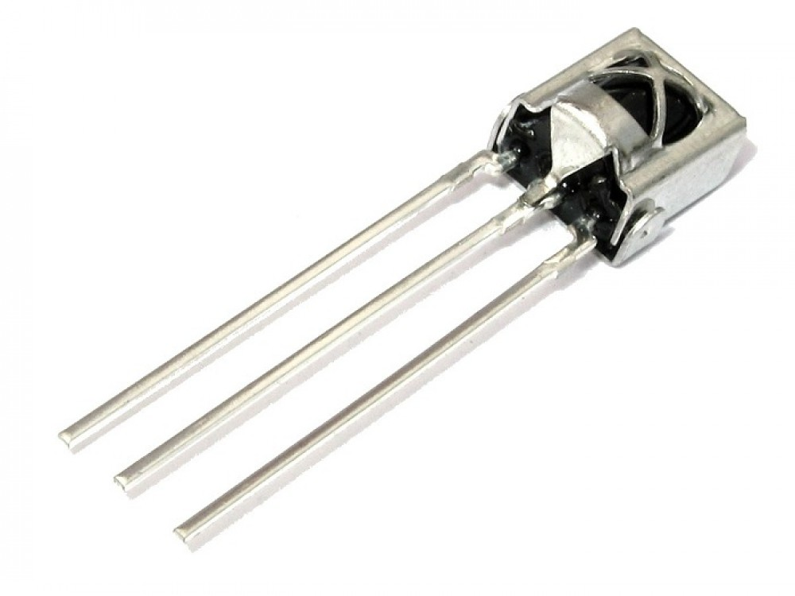
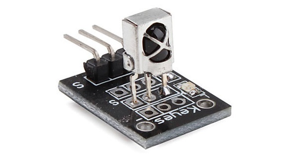
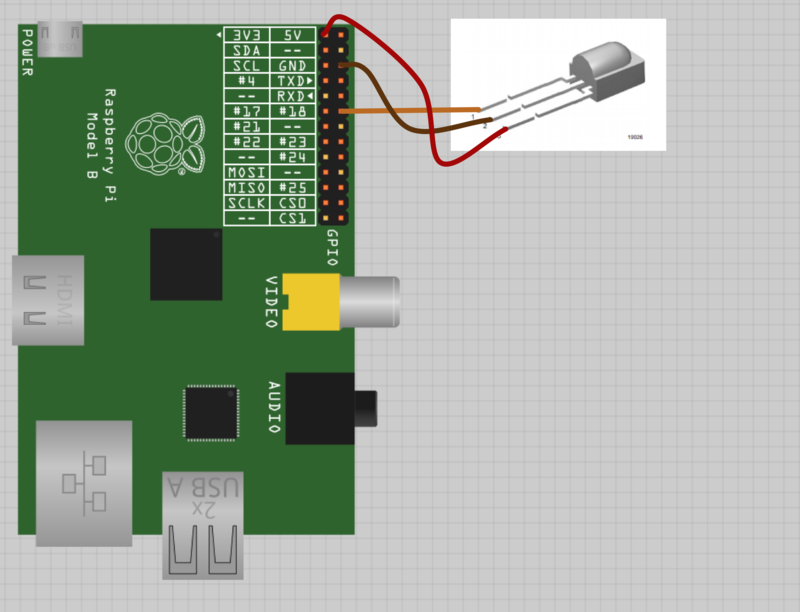
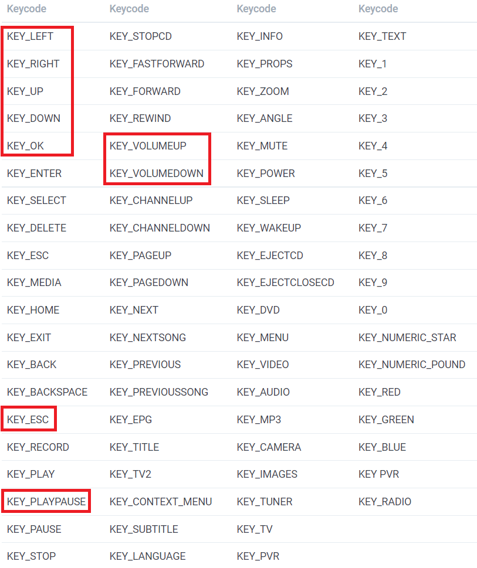

# 红外控制

## 红外接收器

- 硬件与连接

     

    

- 配置`config.txt`

    将`/flash/`改成可读写： `mount -o remount,rw /flash`

    在`/flash/config.txt`文件中增加配置`dtoverlay=gpio-ir,gpio_pin=18`

    将`/flash/`改成只读： `mount -o remount,ro /flash`

    需要重启后生效

- 测试红外遥控的接收

    `ir-keytable -p all -t`

## 配置红外键


需要建立红外遥控器上的按钮，与键值(keycode)之间的对应关系

- 一些常用的键值

    

    *通常情况下，只需要实现最最常用的那些键值即可*

- 自定义keymap文件样例

    参考： 预定义的一些keymap文件`/usr/lib/udev/rc_keymaps/`

    文件保存位置： `/storage/.config/rc_keymaps/custom_remote`
 
    ```
    # table custom_remote, type: nec
    0x820b KEY_UP
    0x8206 KEY_DOWN
    0x8202 KEY_LEFT
    0x820d KEY_RIGHT
    0x8203 KEY_OK
    0x820f KEY_ESC
    0x8204 KEY_PLAYPAUSE
    ```

    *文件必须保存为linux格式*

- 加载keymap

    `ir-keytable -c -w /storage/.config/rc_keymaps/custom_remote`

- 测试

    `irw`

- 启动时加载keymap

    文件：`/storage/.config/rc_maps.cfg`

    内容：`* * custom_remote`
