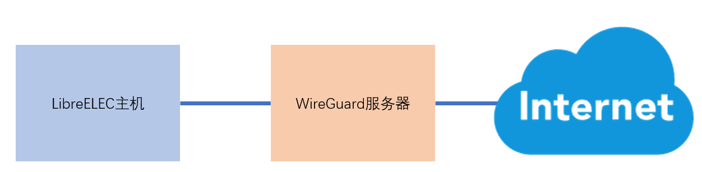

# 通过WireGuard访问

*在进入本文内容之前，首先需要准备一台WireGuard服务器，搭建过程可以参考
[网络访问受限解决方案](https://github.com/zhujisheng/Home-Assistant-DIY/blob/master/04.%E5%85%AC%E7%BD%91%E8%AE%BF%E9%97%AE%E7%AF%87/A.Raw_WireGuard.md)*



## 信息准备

- WireGuard服务器相关信息
    + IP
    + 服务端口
    + 公钥

- 客户端连入信息
    + 在VPN网络中的IP地址
    + 公私钥对

        `wg genkey | tee privatekey | wg pubkey > publickey`

        运行以上命令后，公钥和私钥存放在文件`publickey`和`privatekey`中


## 配置客户端

*在`/storage/.config/wireguard/`目录中，创建一个后缀名为`.config`的文件，其中包含WireGuard的配置*

- 文件位置

    `/storage/.config/wireguard/`

    或者在samba共享的`\\192.168.3.166\Configfiles\wireguard\`

- 文件后缀：`.config`

- 内容样例

    ```
    [provider_wireguard]
    Type = WireGuard
    # 服务器IP地址
    Host = 185.210.30.121
    # 服务器开放端口号
    WireGuard.EndpointPort = 51820
    # 服务器的公钥
    WireGuard.PublicKey = zzqUfWGIil6QxrAGz77HE5BGUEdD2PgHYnCg3CDKagE=

    Name = WireGuard(KODI)
    # 客户端在VPN网络中的IP地址
    WireGuard.Address = 172.27.66.101/24
    WireGuard.DNS = 8.8.8.8
    WireGuard.AllowedIPs = 0.0.0.0/0
    WireGuard.PersistentKeepalive = 25
    # 客户端的私钥
    WireGuard.PrivateKey = IFo+zxrWbkUyQ6hxlDEfbSKXZxrO4W5IC03+kfYbbGo=
    ```

- 说明

    | 类型 | 配置项 | 含义 |
    | -- | -- | :-- |
    | 服务器端信息 | Host | WireGuard服务器地址 |
    | 服务器端信息 | WireGuard.EndpointPort | WireGuard服务端口 |
    | 服务器端信息 | WireGuard.PublicKey | WireGuard服务端公钥 |
    | 服务器端信息 | WireGuard.PresharedKey | WireGuard服务端预享密钥（可选） |
    | 客户端信息 | Name | 给客户端随便取个名字 |
    | 客户端信息 | WireGuard.Address | 客户端在VPN中的IP地址与子网掩码 |
    | 客户端信息 | WireGuard.ListenPort | 客户端监听端口（可选） |
    | 客户端信息 | WireGuard.DNS | 域名服务器地址 |
    | 客户端信息 | WireGuard.AllowedIPs | 哪些地址访问需要通过VPN |
    | 客户端信息 | WireGuard.PersistentKeepalive | 多长时间会发送心跳，以保持常连 |
    | 客户端信息 | WireGuard.PrivateKey | 客户端私钥 |

# 配置服务器端

在WireGuard的配置文件中增加以下的节点信息后，重新启动服务端的wireguard

```
......

[Peer]
# 客户端的公钥
PublicKey = sNqUhqw1gNOBQ8Gu3iIGxt+jknUthsRQqKI7uxC2GhI=
# 在VPN网络中的IP地址
AllowedIPs = 172.27.66.101/32
```


## 连接

- 查看可用连接

    `connmanctl services`

- VPN连接与断开

    `connmanctl connect vpn_xx_xxx_xx_x`

    `connmanctl disconnect vpn_xx_xxx_xx_x`

    你也可以在KODI的前端界面，进行连接与断开操作：`Settings`-`LibreElec`-`Connections`

- 查看网络信息

    + `ifconfig`：网卡信息
    + `route`：路由信息
    + `wg`：WireGuard信息

## 加入开机自启动

- 拷贝服务样例文件

    `cp /storage/.config/system.d/wireguard.service.sample /storage/.config/system.d/wireguard.service`

- 修改服务文件

    `/storage/.config/system.d/wireguard.service`

    或者`/storage/.config/system.d/wireguard.service`

    仅需要修改其中两处vpn连接名称

- 加入自启动

    `systemctl enable /storage/.config/system.d/wireguard.service`
