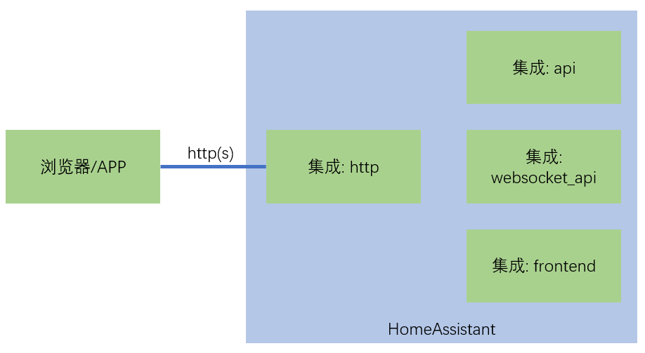

# 前端内容加载机制

## 主要的HTTP协议相关组件

- API服务（动态内容）

    API提供的服务内容：配置信息、实体状态信息、调用服务、事件触发等

    + `api`集成

        提供[RESTful API](https://developers.home-assistant.io/docs/api/rest)

    + `websocket_api`集成

        提供[WebSocket API](https://developers.home-assistant.io/docs/api/websocket)

    参见课程[《HTTP服务-www目录与API调用》](https://study.163.com/course/courseLearn.htm?courseId=1006189053&share=2&shareId=400000000624093#/learn/video?lessonId=1282127005&courseId=1006189053)

    *RESTful/WebSocket API之间的主要区别：RESTful接口，每次由客户端主动发起请求，获得反馈；WebSocket接口除此之外，可以由服务器端主动发送信息给客户端*

- 静态内容服务

    提供HTML、JavaScript、图片、样式定义（CSS）等静态内容

    - `frontend`集成

## [frontend集成](https://www.home-assistant.io/integrations/frontend/)

- 将python包`hass_frontend`所在目录映射到对外URL

    docker安装的HomeAssistant Core，`home-assistant-frontend`包所在的位置`/usr/local/lib/python*.*/site-packages/hass_frontend/`

    *`hass_frontend`文件夹中的内容是由一系列复杂的步骤生成的（也就是前端开发环境），并不适合直接修改*

- 如果存在`/config/www`目录，将其中内容映射到对外URL(http://homeassistant.local:8123/local/)

- 配置主题(themes)、加载额外的JavaScript

- `frontend`集成，由`default_config`集成加载