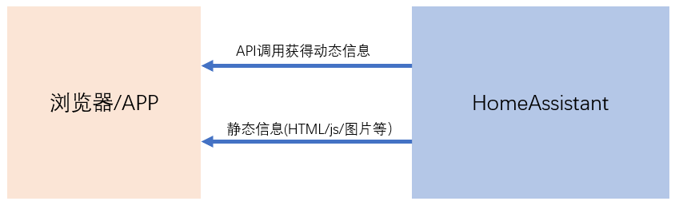
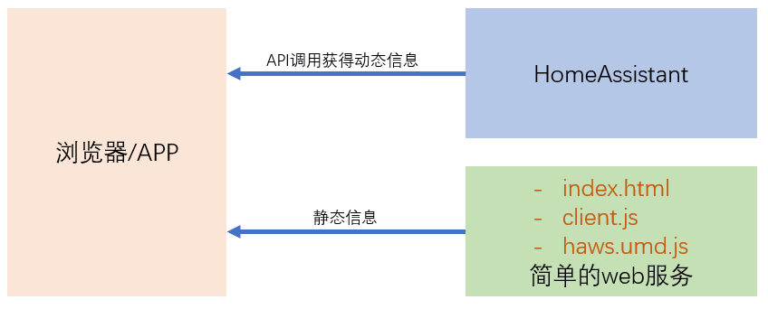
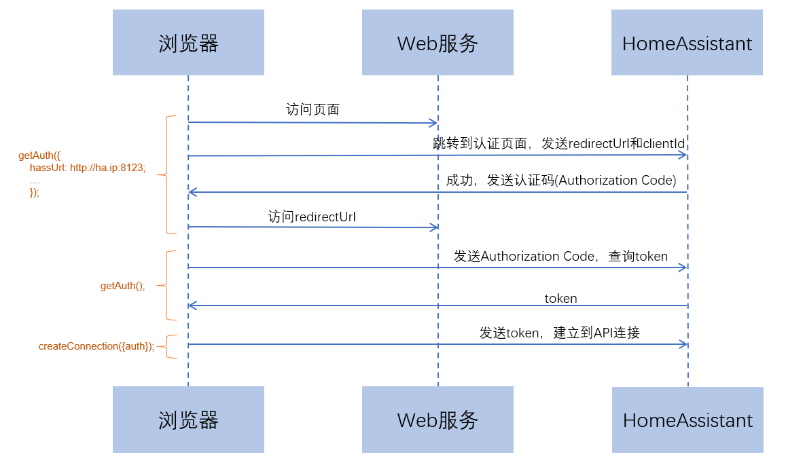

# 前端基础逻辑

## 动态信息与静态信息

## 简单样例

- 下载三个文件

    + [index.html](programs/simple_frontend/index.html)
    + [client.js](programs/simple_frontend/client.js)
    + [haws.umd.js](programs/simple_frontend/haws.umd.js)

        `haws.umd.js`来自于开源项目[home-assistant-js-websocket](https://github.com/home-assistant/home-assistant-js-websocket)

- 构建简单的WEB服务

    `python -m http.server`

- 功能
    + OAuth2登录
    + 实体状态显示与控制

## OAuth2逻辑过程

- `getAuth()`

    完成OAuth2认证

    参数：
    - `hassURL`
    - `clientID`
    - `redirectUrl`
    - ......

    *当有参数传入时，浏览器跳转到`hassURL`*

    *当没有参数传入时，获得访问token*

- `createConnection()`

    建立到API服务端口的连接，并完成认证

    参数：

    - `auth`  由`getAuth()`返回

## `haws`中对API调用的封装

- `subscribeEntities()`

- `subscribeConfig()`

- `callService()`

- `getStates()`

- `getUser()`

- ......

`home-assistant-js-websocket`详细的函数说明，请参见`haws.umd.js`源代码，或者[项目官网](https://github.com/home-assistant/home-assistant-js-websocket)

**Javascript在浏览器端运行，完成HomeAssistant的认证、API访问过程，并将访问获得的结果，注入到html中，以网页的形式展现给用户。**
