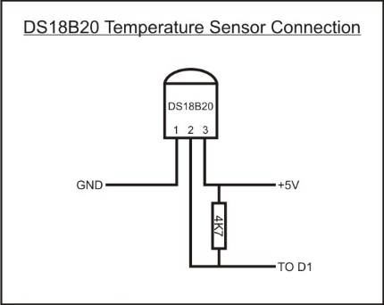

# 直连树莓派的温湿度传感器

**从HomeAssistant Core`2022.6`版本开始，本视频中所配置的集成将删除。HomeAssistant Core中将不再提供直接连接GPIP的官方集成。**

## 硬件准备

温湿度传感器：dht11/dht22/18b20


## 操作步骤

1. 在HomeAssistant中配置DHT传感器
2. 在Node-RED中配置DHT传感器
3. 在树莓派上打开1-wire通讯
4. 在HomeAssistant中配置18b20
5. 在Node-RED中配置18b20

## 参考

- 连接示意图

    

- DHT温湿度传感器在HA中的配置

    [https://www.home-assistant.io/integrations/dht](https://www.home-assistant.io/integrations/dht)

    ```yaml
    sensor:
      - platform: dht
        sensor: DHT11
        pin: 18
        monitored_conditions:
          - temperature
          - humidity
    ```
- bcm2835开发包

    [http://www.airspayce.com/mikem/bcm2835/](http://www.airspayce.com/mikem/bcm2835/)

- 18b20在HA中的配置

    [https://www.home-assistant.io/integrations/onewire](https://www.home-assistant.io/integrations/onewire)

    ```yaml
    sensor:
      - platform: onewire
    ```
